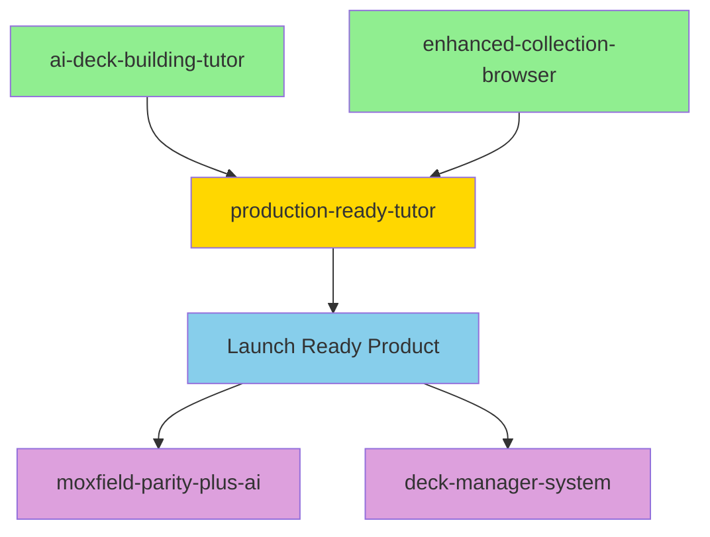

# MoxMuse Specifications

This directory contains the specifications for MoxMuse features and systems. This README clarifies the current status and relationships between different specs.

## Current Status & Priority

### 🎯 ACTIVE SPECIFICATION (Primary Focus)
- **[production-ready-tutor](production-ready-tutor/)** - The current implementation plan for getting the AI Deck Building Tutor to production readiness

### ✅ COMPLETED SPECIFICATIONS (Reference Only)
- **[ai-deck-building-tutor](ai-deck-building-tutor/)** - Original AI Deck Building Tutor spec (COMPLETED - all tasks done)
- **[enhanced-collection-browser](enhanced-collection-browser/)** - Collection browsing improvements (COMPLETED - all tasks done)

### 📋 FUTURE SPECIFICATIONS (Post-Launch)
- **[moxfield-parity-plus-ai](moxfield-parity-plus-ai/)** - Comprehensive platform features for future development
- **[deck-manager-system](deck-manager-system/)** - Advanced deck management features for future development

## Specification Relationships

## Implementation Strategy

### Phase 1: Production Launch (Current)
**Spec**: `production-ready-tutor`
**Goal**: Launch a reliable, production-ready AI Deck Building Tutor
**Timeline**: 6 weeks
**Status**: In Progress

**Key Features**:
- Reliable AI deck generation
- Complete card database
- Production infrastructure
- Mobile-optimized experience
- Performance optimization

### Phase 2: Platform Expansion (Future)
**Specs**: `moxfield-parity-plus-ai`, `deck-manager-system`
**Goal**: Expand into a comprehensive deck building platform
**Timeline**: Post-launch (3-6 months)
**Status**: Planned

**Key Features**:
- Advanced deck management
- Social and community features
- Collection management
- Multi-format support
- Advanced analytics

## Specification Guidelines

### Active Development
- Focus ONLY on `production-ready-tutor` specification
- All development effort should align with production readiness goals
- Reference completed specs for implementation details but don't expand scope

### Future Planning
- Use `moxfield-parity-plus-ai` and `deck-manager-system` for post-launch planning
- These specs define the long-term vision but are not current priorities
- Update these specs as needed but don't implement until Phase 1 is complete

### Completed Specs
- Keep `ai-deck-building-tutor` and `enhanced-collection-browser` as reference
- These document what has been built and can guide maintenance
- Don't add new requirements to completed specs

## Decision Framework

When making development decisions, prioritize in this order:

1. **Production Readiness** - Does this help launch the product?
2. **User Value** - Does this provide immediate value to users?
3. **Technical Debt** - Does this improve system reliability?
4. **Future Features** - Does this enable future development?

## Updating Specifications

### For Current Development
- Update `production-ready-tutor` as needed for production readiness
- Mark tasks as complete when implemented
- Add new requirements only if critical for launch

### For Future Planning
- Update future specs based on user feedback and market research
- Refine requirements based on technical learnings
- Maintain alignment with overall product vision

---

**Current Focus**: Get the AI Deck Building Tutor to production with the `production-ready-tutor` specification.