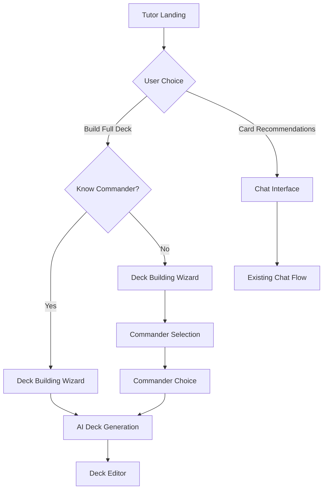

# AI Deck Building Tutor Design

## Overview

The AI Deck Building Tutor is a comprehensive system that transforms the deck creation experience from a simple chat interface into a guided, intelligent workflow. The system provides multiple entry points based on user needs, leverages AI for contextual recommendations, and culminates in a sophisticated deck editor that rivals professional tools like Moxfield.

The design builds upon the existing tutor infrastructure while adding new components for wizard-based consultation, commander selection, deck generation, and an advanced deck editor with interactive statistics and analysis.

## Architecture

### High-Level System Flow


### Component Architecture
```
TutorSystem
├── EntryPointSelector
│   ├── DeckBuildingOption
│   └── CardRecommendationOption
├── DeckBuildingWizard
│   ├── PreferenceCollector
│   ├── ConstraintGatherer
│   └── ContextBuilder
├── CommanderSelectionSystem
│   ├── AICommanderGenerator
│   ├── CommanderDisplayGrid
│   └── CommanderSelector
├── DeckGenerationEngine
│   ├── AIPromptBuilder
│   ├── DeckAssembler
│   └── ValidationEngine
└── DeckEditor
    ├── CardListManager
    ├── StatisticsEngine
    ├── InteractiveCharts
    ├── CardDetailModal
    └── StrategyAnalyzer
```

## Data Models

### Enhanced Consultation Data
```typescript
interface ConsultationData {
  // Entry point selection
  buildingFullDeck: boolean
  needsCommanderSuggestions: boolean
  
  // Commander information
  commander?: string
  commanderColors?: string[]
  
  // Strategy preferences
  strategy?: 'aggro' | 'control' | 'combo' | 'midrange' | 'tribal' | 'value' | 'stax'
  themes?: string[]
  customTheme?: string
  
  // Constraints
  budget?: number
  powerLevel?: number // 1-4 bracket system
  useCollection?: boolean
  
  // Color preferences
  colorPreferences?: string[]
  specificColors?: string[]
  
  // Win conditions
  winConditions?: {
    primary: 'combat' | 'combo' | 'alternative' | 'control'
    secondary?: string[]
    combatStyle?: 'aggro' | 'voltron' | 'tokens' | 'big-creatures'
    comboType?: 'infinite' | 'synergy' | 'engine'
  }
  
  // Interaction preferences
  interaction?: {
    level: 'low' | 'medium' | 'high'
    types: string[]
    timing: 'proactive' | 'reactive' | 'balanced'
  }
  
  // Social dynamics
  politics?: {
    style: 'diplomatic' | 'aggressive' | 'hidden' | 'chaotic'
    threatLevel: 'low-profile' | 'moderate' | 'high-threat'
  }
  
  // Restrictions and preferences
  avoidStrategies?: string[]
  avoidCards?: string[]
  petCards?: string[]
  complexityLevel?: 'simple' | 'moderate' | 'complex'
  
  // Mana base preferences
  manaStrategy?: {
    fetchlands: boolean
    utilityLands: boolean
    tapLandRatio: 'low' | 'medium' | 'high'
    budget: number
  }
}
```

### Generated Deck Structure
```typescript
interface GeneratedDeck {
  id: string
  name: string
  commander: string
  format: 'commander'
  
  // Strategy context
  strategy: DeckStrategy
  winConditions: WinCondition[]
  powerLevel: number
  estimatedBudget: number
  
  // Card composition
  cards: GeneratedDeckCard[]
  categories: DeckCategory[]
  
  // Analysis
  statistics: DeckStatistics
  synergies: CardSynergy[]
  weaknesses: string[]
  
  // Metadata
  generatedAt: Date
  consultationData: ConsultationData
}

interface GeneratedDeckCard {
  cardId: string
  quantity: number
  category: string
  role: string
  reasoning: string
  alternatives?: string[]
  upgradeOptions?: string[]
  budgetOptions?: string[]
}

interface DeckCategory {
  name: string
  description: string
  targetCount: number
  actualCount: number
  cards: string[]
}

interface DeckStatistics {
  manaCurve: ManaCurveData
  colorDistribution: ColorDistribution
  typeDistribution: TypeDistribution
  rarityDistribution: RarityDistribution
  averageCMC: number
  totalValue: number
  landCount: number
  nonlandCount: number
}

interface ManaCurveData {
  distribution: number[] // [0, 1, 2, 3, 4, 5, 6, 7+]
  peakCMC: number
  averageCMC: number
  landRatio: number
}

interface ColorDistribution {
  white: number
  blue: number
  black: number
  red: number
  green: number
  colorless: number
  multicolor: number
  devotion: Record<string, number>
}
```

## Component Design

### 1. Entry Point Selector
```typescript
interface EntryPointSelectorProps {
  onDeckBuilding: () => void
  onCardRecommendations: () => void
}

const EntryPointSelector: React.FC<EntryPointSelectorProps> = ({
  onDeckBuilding,
  onCardRecommendations
}) => {
  return (
    <div className="grid grid-cols-1 md:grid-cols-2 gap-6 max-w-4xl mx-auto">
      <DeckBuildingOption onClick={onDeckBuilding} />
      <CardRecommendationOption onClick={onCardRecommendations} />
    </div>
  )
}
```

### 2. Deck Building Wizard
```typescript
interface DeckBuildingWizardProps {
  onComplete: (data: ConsultationData) => void
  onBack: () => void
}

const DeckBuildingWizard: React.FC<DeckBuildingWizardProps> = ({
  onComplete,
  onBack
}) => {
  const [currentStep, setCurrentStep] = useState(0)
  const [consultationData, setConsultationData] = useState<ConsultationData>({})
  
  const steps = [
    CommanderStep,
    StrategyStep,
    BudgetStep,
    PowerLevelStep,
    ThemesStep,
    WinConditionsStep,
    InteractionStep,
    RestrictionsStep,
    SummaryStep
  ]
  
  return (
    <WizardContainer>
      <WizardProgress current={currentStep} total={steps.length} />
      <StepComponent
        data={consultationData}
        onChange={setConsultationData}
        onNext={() => setCurrentStep(prev => prev + 1)}
        onBack={() => setCurrentStep(prev => prev - 1)}
        onComplete={() => onComplete(consultationData)}
      />
    </WizardContainer>
  )
}
```

### 3. Commander Selection System
```typescript
interface CommanderSelectionProps {
  consultationData: ConsultationData
  onCommanderSelected: (commander: string) => void
  onRequestMore: () => void
}

const CommanderSelection: React.FC<CommanderSelectionProps> = ({
  consultationData,
  onCommanderSelected,
  onRequestMore
}) => {
  const [commanders, setCommanders] = useState<CommanderRecommendation[]>([])
  const [isLoading, setIsLoading] = useState(true)
  
  const generateCommanders = useCallback(async () => {
    setIsLoading(true)
    const prompt = buildCommanderPrompt(consultationData)
    const results = await trpc.tutor.getCommanderSuggestions.mutate({
      sessionId: generateSessionId(),
      prompt,
      constraints: {
        budget: consultationData.budget,
        powerLevel: consultationData.powerLevel
      }
    })
    setCommanders(results)
    setIsLoading(false)
  }, [consultationData])
  
  return (
    <div className="space-y-6">
      <CommanderGrid
        commanders={commanders}
        onSelect={onCommanderSelected}
        isLoading={isLoading}
      />
      <CommanderActions
        onRequestMore={onRequestMore}
        onManualEntry={onCommanderSelected}
      />
    </div>
  )
}
```

### 4. Deck Generation Engine
```typescript
interface DeckGenerationEngineProps {
  consultationData: ConsultationData
  commander: string
  onDeckGenerated: (deck: GeneratedDeck) => void
}

const DeckGenerationEngine: React.FC<DeckGenerationEngineProps> = ({
  consultationData,
  commander,
  onDeckGenerated
}) => {
  const [progress, setProgress] = useState(0)
  const [currentPhase, setCurrentPhase] = useState<string>('')
  
  const generateDeck = useCallback(async () => {
    setCurrentPhase('Analyzing commander and strategy...')
    setProgress(10)
    
    // Build comprehensive prompt
    const prompt = buildDeckGenerationPrompt(consultationData, commander)
    
    setCurrentPhase('Generating card recommendations...')
    setProgress(30)
    
    // Get AI recommendations
    const recommendations = await trpc.tutor.generateFullDeck.mutate({
      sessionId: generateSessionId(),
      prompt,
      constraints: {
        budget: consultationData.budget,
        powerLevel: consultationData.powerLevel,
        useCollection: consultationData.useCollection
      }
    })
    
    setCurrentPhase('Assembling deck structure...')
    setProgress(60)
    
    // Process and categorize cards
    const deck = await assembleDeck(recommendations, consultationData, commander)
    
    setCurrentPhase('Calculating statistics and synergies...')
    setProgress(80)
    
    // Generate statistics and analysis
    const enhancedDeck = await enhanceDeckWithAnalysis(deck)
    
    setProgress(100)
    onDeckGenerated(enhancedDeck)
  }, [consultationData, commander, onDeckGenerated])
  
  return (
    <GenerationProgress
      progress={progress}
      phase={currentPhase}
      onGenerate={generateDeck}
    />
  )
}
```

### 5. Advanced Deck Editor
```typescript
interface DeckEditorProps {
  deck: GeneratedDeck
  onDeckUpdate: (deck: GeneratedDeck) => void
  onSave: () => void
  onExport: (format: string) => void
}

const DeckEditor: React.FC<DeckEditorProps> = ({
  deck,
  onDeckUpdate,
  onSave,
  onExport
}) => {
  const [selectedCard, setSelectedCard] = useState<string | null>(null)
  const [viewMode, setViewMode] = useState<'category' | 'type' | 'cmc'>('category')
  const [filterText, setFilterText] = useState('')
  
  return (
    <div className="flex h-screen">
      {/* Main deck view */}
      <div className="flex-1 flex flex-col">
        <DeckHeader
          deck={deck}
          onSave={onSave}
          onExport={onExport}
          viewMode={viewMode}
          onViewModeChange={setViewMode}
          filterText={filterText}
          onFilterChange={setFilterText}
        />
        
        <div className="flex-1 overflow-y-auto">
          <DeckCardList
            deck={deck}
            viewMode={viewMode}
            filterText={filterText}
            onCardSelect={setSelectedCard}
            onCardUpdate={onDeckUpdate}
          />
        </div>
        
        <DeckStrategyPanel deck={deck} />
      </div>
      
      {/* Statistics sidebar */}
      <DeckStatisticsSidebar
        deck={deck}
        onCardHighlight={setSelectedCard}
      />
      
      {/* Card detail modal */}
      {selectedCard && (
        <CardDetailModal
          cardId={selectedCard}
          deck={deck}
          onClose={() => setSelectedCard(null)}
          onCardUpdate={onDeckUpdate}
        />
      )}
    </div>
  )
}
```

### 6. Interactive Statistics Components
```typescript
interface InteractiveManaCurveProps {
  distribution: number[]
  onCMCSelect: (cmc: number) => void
  selectedCMC?: number
}

const InteractiveManaCurve: React.FC<InteractiveManaCurveProps> = ({
  distribution,
  onCMCSelect,
  selectedCMC
}) => {
  return (
    <div className="space-y-2">
      <h3 className="text-sm font-medium text-zinc-300">Mana Curve</h3>
      <div className="space-y-1">
        {distribution.map((count, cmc) => (
          <div
            key={cmc}
            className={`flex items-center gap-2 cursor-pointer hover:bg-zinc-700/50 rounded p-1 ${
              selectedCMC === cmc ? 'bg-zinc-600/50' : ''
            }`}
            onClick={() => onCMCSelect(cmc)}
          >
            <span className="text-xs text-zinc-400 w-6">
              {cmc === 7 ? '7+' : cmc}
            </span>
            <div className="flex-1 bg-zinc-800 rounded-full h-4 overflow-hidden">
              <div
                className="h-full bg-gradient-to-r from-purple-500 to-blue-500 transition-all"
                style={{
                  width: `${Math.max(4, (count / Math.max(...distribution)) * 100)}%`
                }}
              />
            </div>
            <span className="text-xs text-zinc-400 w-6 text-right">{count}</span>
          </div>
        ))}
      </div>
    </div>
  )
}

interface ColorDistributionPieProps {
  distribution: ColorDistribution
  onColorSelect: (color: string) => void
}

const ColorDistributionPie: React.FC<ColorDistributionPieProps> = ({
  distribution,
  onColorSelect
}) => {
  // Implementation using a charting library like Recharts or D3
  return (
    <div className="space-y-3">
      <h3 className="text-sm font-medium text-zinc-300">Color Distribution</h3>
      <PieChart data={distribution} onSegmentClick={onColorSelect} />
      <ColorLegend distribution={distribution} />
    </div>
  )
}
```

## API Extensions

### New tRPC Procedures
```typescript
// Enhanced tutor router
export const tutorRouter = createTRPCRouter({
  // Existing procedures...
  
  generateFullDeck: protectedProcedure
    .input(z.object({
      sessionId: z.string(),
      prompt: z.string(),
      constraints: z.object({
        budget: z.number().optional(),
        powerLevel: z.number().optional(),
        useCollection: z.boolean().optional(),
      }).optional(),
    }))
    .mutation(async ({ ctx, input }) => {
      // Generate complete 100-card deck
      const recommendations = await openaiService.generateCompleteDeck(input)
      return processDeckRecommendations(recommendations, ctx)
    }),
    
  analyzeDeck: protectedProcedure
    .input(z.object({
      deckId: z.string(),
    }))
    .query(async ({ ctx, input }) => {
      // Analyze existing deck for statistics and synergies
      const deck = await getDeckWithCards(input.deckId, ctx)
      return analyzeDeckComposition(deck)
    }),
    
  suggestDeckImprovements: protectedProcedure
    .input(z.object({
      deckId: z.string(),
      focusArea: z.enum(['mana-curve', 'removal', 'draw', 'ramp', 'win-cons']).optional(),
    }))
    .mutation(async ({ ctx, input }) => {
      // Suggest specific improvements to existing deck
      const deck = await getDeckWithCards(input.deckId, ctx)
      return generateImprovementSuggestions(deck, input.focusArea)
    }),
    
  exportDeck: protectedProcedure
    .input(z.object({
      deckId: z.string(),
      format: z.enum(['text', 'json', 'moxfield', 'archidekt']),
    }))
    .mutation(async ({ ctx, input }) => {
      // Export deck in various formats
      const deck = await getDeckWithCards(input.deckId, ctx)
      return exportDeckToFormat(deck, input.format)
    }),
})
```

### Enhanced OpenAI Service
```typescript
interface DeckGenerationInput {
  consultationData: ConsultationData
  commander: string
  constraints?: {
    budget?: number
    powerLevel?: number
    useCollection?: boolean
  }
}

export const openaiService = {
  // Existing methods...
  
  async generateCompleteDeck(input: DeckGenerationInput): Promise<DeckRecommendation[]> {
    const systemPrompt = buildDeckGenerationSystemPrompt()
    const userPrompt = buildDeckGenerationUserPrompt(input)
    
    const response = await openai.chat.completions.create({
      model: 'gpt-4',
      messages: [
        { role: 'system', content: systemPrompt },
        { role: 'user', content: userPrompt }
      ],
      temperature: 0.7,
      max_tokens: 4000,
    })
    
    return parseDeckGenerationResponse(response.choices[0]?.message?.content)
  },
  
  async analyzeDeckSynergies(cards: DeckCard[]): Promise<CardSynergy[]> {
    // Analyze card interactions and synergies
    const prompt = buildSynergyAnalysisPrompt(cards)
    // ... implementation
  },
  
  async suggestDeckStrategy(deck: GeneratedDeck): Promise<StrategyAnalysis> {
    // Generate strategy description and win condition analysis
    const prompt = buildStrategyAnalysisPrompt(deck)
    // ... implementation
  }
}
```

## Database Schema Extensions

### New Tables for Deck Generation
```sql
-- Generated decks with full context
CREATE TABLE generated_decks (
  id TEXT PRIMARY KEY,
  user_id TEXT REFERENCES users(id) ON DELETE CASCADE,
  session_id TEXT NOT NULL,
  name TEXT NOT NULL,
  commander TEXT NOT NULL,
  format TEXT DEFAULT 'commander',
  
  -- Strategy context
  strategy JSONB NOT NULL,
  win_conditions JSONB NOT NULL,
  power_level INTEGER,
  estimated_budget DECIMAL(10,2),
  
  -- Generation metadata
  consultation_data JSONB NOT NULL,
  generation_prompt TEXT,
  
  -- Status
  status TEXT DEFAULT 'generated', -- generated, saved, exported
  
  created_at TIMESTAMP DEFAULT NOW(),
  updated_at TIMESTAMP DEFAULT NOW()
);

-- Generated deck cards with enhanced metadata
CREATE TABLE generated_deck_cards (
  id TEXT PRIMARY KEY,
  deck_id TEXT REFERENCES generated_decks(id) ON DELETE CASCADE,
  card_id TEXT NOT NULL,
  quantity INTEGER NOT NULL DEFAULT 1,
  
  -- Categorization
  category TEXT NOT NULL, -- ramp, draw, removal, win-con, etc.
  role TEXT, -- primary, secondary, utility
  reasoning TEXT,
  
  -- Alternatives and upgrades
  alternatives TEXT[], -- Array of card IDs
  upgrade_options TEXT[],
  budget_options TEXT[],
  
  created_at TIMESTAMP DEFAULT NOW()
);

-- Deck analysis cache
CREATE TABLE deck_analysis (
  id TEXT PRIMARY KEY,
  deck_id TEXT REFERENCES generated_decks(id) ON DELETE CASCADE,
  
  -- Statistics
  statistics JSONB NOT NULL,
  synergies JSONB NOT NULL,
  weaknesses TEXT[],
  
  -- Strategy analysis
  strategy_description TEXT,
  win_condition_analysis TEXT,
  play_pattern_description TEXT,
  
  analyzed_at TIMESTAMP DEFAULT NOW()
);

-- Consultation sessions
CREATE TABLE consultation_sessions (
  id TEXT PRIMARY KEY,
  user_id TEXT REFERENCES users(id) ON DELETE CASCADE,
  session_id TEXT UNIQUE NOT NULL,
  
  -- Session data
  consultation_data JSONB NOT NULL,
  current_step TEXT,
  completed BOOLEAN DEFAULT FALSE,
  
  -- Results
  generated_deck_id TEXT REFERENCES generated_decks(id),
  
  created_at TIMESTAMP DEFAULT NOW(),
  updated_at TIMESTAMP DEFAULT NOW()
);
```

## User Experience Flow

### 1. Entry Point Selection
- Clean, visual choice between "Build Full Deck" and "Get Card Recommendations"
- Clear descriptions of what each option provides
- Visual examples or previews of the end result

### 2. Deck Building Wizard
- Progressive disclosure of complexity
- Smart defaults based on popular choices
- Visual progress indicator
- Ability to go back and modify previous choices
- Contextual help and examples for each step

### 3. Commander Selection (if needed)
- Grid layout showing 5 commanders with images
- Clear explanations of why each commander fits
- Easy way to request different options
- Manual commander entry option
- Search and filter capabilities

### 4. Deck Generation
- Engaging progress indicator with phase descriptions
- Estimated time remaining
- Ability to cancel and restart
- Clear error handling and retry options

### 5. Deck Editor
- Moxfield-inspired layout with modern improvements
- Responsive design for mobile and desktop
- Keyboard shortcuts for power users
- Drag-and-drop card management
- Real-time statistics updates
- Contextual card suggestions

## Performance Considerations

### Caching Strategy
- Cache commander suggestions by preference combinations
- Store deck generation templates for common strategies
- Cache card statistics and synergy data
- Implement progressive loading for large deck lists

### Optimization Techniques
- Lazy load card images and details
- Virtualize large card lists
- Debounce search and filter operations
- Preload critical path components
- Optimize bundle size with code splitting

### Scalability
- Queue system for AI generation requests
- Rate limiting for expensive operations
- Database indexing for common queries
- CDN for static assets and card images

## Security and Privacy

### Data Protection
- Encrypt consultation data at rest
- Anonymize AI training data
- Secure API endpoints with proper authentication
- Validate all user inputs

### Rate Limiting
- Limit deck generation requests per user per hour
- Throttle AI API calls to prevent abuse
- Implement progressive backoff for failed requests

## Testing Strategy

### Unit Tests
- Component rendering and interaction
- Utility functions and data processing
- API endpoint logic
- Database operations

### Integration Tests
- Complete wizard flow
- Deck generation pipeline
- Statistics calculation accuracy
- Export functionality

### End-to-End Tests
- Full user journey from entry to deck completion
- Cross-browser compatibility
- Mobile responsiveness
- Performance benchmarks

## Migration and Rollout

### Phase 1: Foundation
- Implement entry point selector
- Create basic wizard framework
- Set up new database tables

### Phase 2: Core Features
- Complete deck building wizard
- Implement commander selection
- Basic deck generation

### Phase 3: Advanced Editor
- Full deck editor with statistics
- Interactive charts and analysis
- Card detail modals

### Phase 4: Polish and Optimization
- Performance improvements
- Advanced features
- Mobile optimization
- Export capabilities