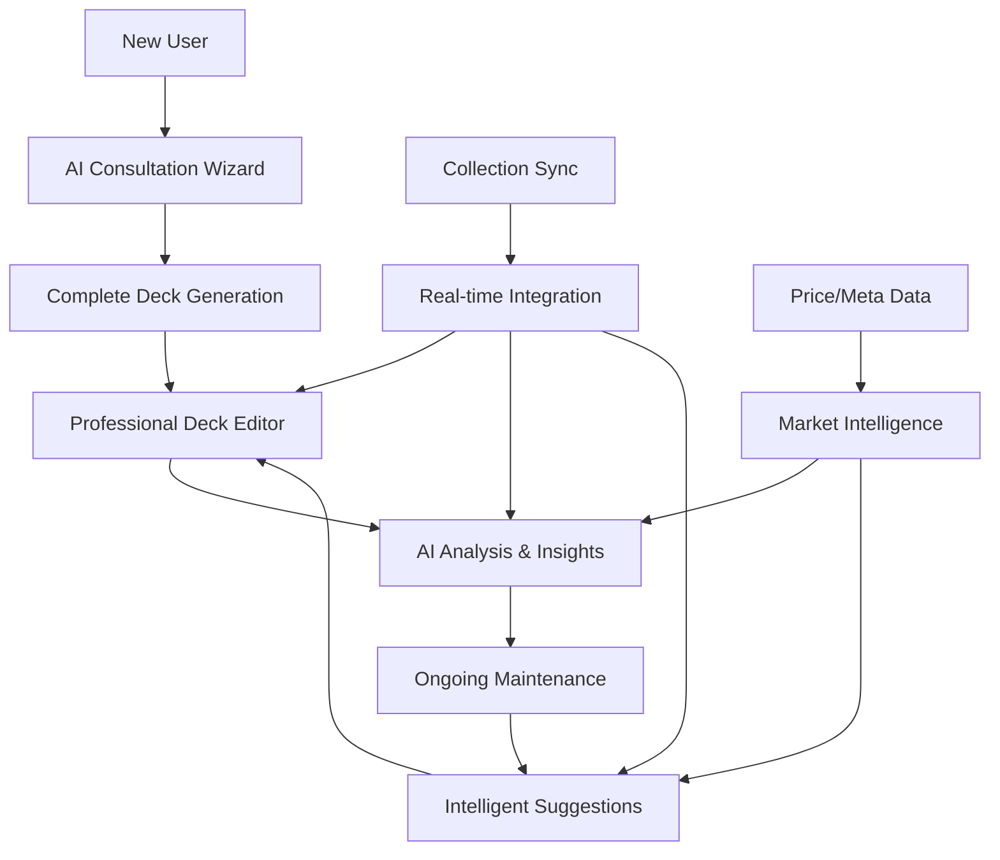

# Moxfield Parity + AI Enhancement Design

## Overview

This design creates a comprehensive deck building platform that surpasses Moxfield's capabilities while adding intelligent AI features that provide hyper-personalized deck optimization. The system encompasses the complete user journey from initial deck creation to long-term portfolio management, with enterprise-grade performance, social features, and community integration.

The architecture builds upon existing infrastructure while adding sophisticated AI analysis, professional deck organization, universal platform integration, advanced analytics, and social features that position us as the definitive Commander/EDH deck building platform.

## Architecture

### High-Level System Flow


### Enhanced Component Architecture
```
ComprehensiveDeckPlatform
├── DeckOrganizationSystem
│   ├── FolderHierarchy
│   ├── DeckTemplates
│   ├── BulkOperations
│   ├── DeckCloning
│   └── AdvancedSearch
├── CardDatabaseEngine
│   ├── ComplexQueryProcessor
│   ├── LegalityValidator
│   ├── OracleTextManager
│   ├── SpoilerIntegration
│   └── RelatedCardSuggestions
├── UniversalImportExport
│   ├── PlatformConnectors
│   │   ├── MoxfieldAdapter
│   │   ├── ArchidektAdapter
│   │   ├── TappedOutAdapter
│   │   └── EDHRECAdapter
│   ├── FormatProcessors
│   ├── BulkImportEngine
│   └── CustomExportBuilder
├── AdvancedAnalytics
│   ├── ManaAnalyzer
│   ├── GoldfishSimulator
│   ├── MetaClassifier
│   ├── PerformanceTracker
│   └── CurveOptimizer
├── SocialCommunityHub
│   ├── DeckSharingSystem
│   ├── CommunityBrowser
│   ├── CommentSystem
│   ├── UserProfiles
│   └── TrendingAnalyzer
├── ProfessionalDeckEditor
│   ├── InteractiveStatistics
│   ├── CardManagement
│   ├── MobileInterface
│   └── RealTimeUpdates
├── IntelligentAIAnalysis
│   ├── SynergyDetector
│   ├── StrategyAnalyzer
│   ├── WeaknessIdentifier
│   ├── MetaComparator
│   └── PersonalizationEngine
├── DeckMaintenanceSystem
│   ├── SetMonitor
│   ├── PreferenceLearning
│   ├── ProactiveSuggestions
│   └── MultiDeckOptimizer
├── CollectionIntegration
│   ├── PlatformConnectors
│   ├── RealTimeSyncing
│   ├── OwnershipTracking
│   └── BudgetCalculator
├── PerformanceInfrastructure
│   ├── VirtualizationEngine
│   ├── OfflineCapabilities
│   ├── IntelligentCaching
│   └── LoadBalancing
└── DataIntelligence
    ├── PriceTracking
    ├── MetaAnalysis
    ├── TournamentData
    └── MarketInsights
```

## Data Models

### Professional Deck Organization
```typescript
interface DeckFolder {
  id: string
  userId: string
  name: string
  description?: string
  color: string
  parentId?: string
  children: DeckFolder[]
  deckIds: string[]
  sortOrder: number
  createdAt: Date
  updatedAt: Date
}

interface DeckTemplate {
  id: string
  userId: string
  name: string
  description: string
  format: string
  archetype: string
  isPublic: boolean
  
  // Template structure
  categories: TemplateCategory[]
  coreCards: TemplateCard[]
  flexSlots: FlexSlot[]
  
  // Metadata
  powerLevel: number
  estimatedBudget: number
  tags: string[]
  usageCount: number
  
  createdAt: Date
  updatedAt: Date
}

interface TemplateCategory {
  name: string
  description: string
  targetCount: number
  minCount: number
  maxCount: number
  priority: number
}

interface TemplateCard {
  cardId: string
  category: string
  isCore: boolean
  alternatives: string[]
  reasoning: string
}

interface FlexSlot {
  category: string
  count: number
  criteria: string
  suggestions: string[]
}
```

### Advanced Card Database Integration
```typescript
interface CardSearchQuery {
  text?: string
  name?: string
  oracleText?: string
  typeText?: string
  
  // Numeric ranges
  cmcRange?: [number, number]
  powerRange?: [number, number]
  toughnessRange?: [number, number]
  
  // Categorical filters
  colors?: string[]
  colorIdentity?: string[]
  rarities?: string[]
  sets?: string[]
  formats?: string[]
  
  // Advanced criteria
  isLegal?: Record<string, boolean>
  hasKeywords?: string[]
  producesColors?: string[]
  
  // Sorting and pagination
  sortBy?: 'name' | 'cmc' | 'power' | 'toughness' | 'releaseDate' | 'price'
  sortOrder?: 'asc' | 'desc'
  limit?: number
  offset?: number
}

interface EnhancedCardData {
  // Core Scryfall data
  id: string
  name: string
  manaCost: string
  cmc: number
  typeLine: string
  oracleText: string
  power?: string
  toughness?: string
  colors: string[]
  colorIdentity: string[]
  
  // Enhanced metadata
  legalities: Record<string, string>
  rulings: CardRuling[]
  printings: CardPrinting[]
  relatedCards: RelatedCard[]
  
  // Community data
  edhrecRank?: number
  popularityScore: number
  synergyTags: string[]
  
  // Market data
  currentPrice: number
  priceHistory: PricePoint[]
  availability: CardAvailability
  
  // Platform integration
  lastUpdated: Date
  imageUrls: Record<string, string>
}

interface CardRuling {
  date: string
  text: string
  source: string
}

interface RelatedCard {
  cardId: string
  relationship: 'synergy' | 'alternative' | 'upgrade' | 'combo'
  strength: number
  explanation: string
}
```

### Universal Import/Export System
```typescript
interface ImportJob {
  id: string
  userId: string
  source: 'moxfield' | 'archidekt' | 'tappedout' | 'edhrec' | 'mtggoldfish' | 'csv' | 'text'
  status: 'pending' | 'processing' | 'completed' | 'failed'
  
  // Input data
  rawData: string
  sourceUrl?: string
  fileName?: string
  
  // Processing results
  decksFound: number
  decksImported: number
  errors: ImportError[]
  warnings: ImportWarning[]
  
  // Metadata
  createdAt: Date
  completedAt?: Date
  processingTime?: number
}

interface ImportError {
  type: 'card_not_found' | 'invalid_format' | 'duplicate_deck' | 'permission_denied'
  message: string
  context?: Record<string, any>
}

interface ExportFormat {
  id: string
  name: string
  description: string
  fileExtension: string
  mimeType: string
  supportsMultipleDecks: boolean
  customizable: boolean
  template?: string
}

interface ExportJob {
  id: string
  userId: string
  deckIds: string[]
  format: ExportFormat
  options: ExportOptions
  status: 'pending' | 'processing' | 'completed' | 'failed'
  
  // Results
  downloadUrl?: string
  fileSize?: number
  expiresAt?: Date
  
  createdAt: Date
  completedAt?: Date
}

interface ExportOptions {
  includeCommander: boolean
  includeSideboard: boolean
  includeTokens: boolean
  includeBasicLands: boolean
  groupByCategory: boolean
  includeQuantities: boolean
  includePrices: boolean
  customFields: string[]
}
```

### Advanced Analytics and Testing
```typescript
interface DeckAnalytics {
  deckId: string
  
  // Mana analysis
  manaAnalysis: ManaAnalysis
  
  // Consistency testing
  consistencyMetrics: ConsistencyMetrics
  
  // Meta positioning
  metaAnalysis: MetaAnalysis
  
  // Performance tracking
  performanceData: PerformanceData
  
  // Optimization suggestions
  optimizationSuggestions: OptimizationSuggestion[]
  
  lastAnalyzed: Date
  analysisVersion: string
}

interface ManaAnalysis {
  colorRequirements: Record<string, number>
  pipAnalysis: PipAnalysis
  fixingRecommendations: FixingRecommendation[]
  manaEfficiency: number
  colorConsistency: Record<string, number>
}

interface PipAnalysis {
  totalPips: Record<string, number>
  pipsByTurn: Record<number, Record<string, number>>
  criticalTurns: number[]
  bottlenecks: string[]
}

interface ConsistencyMetrics {
  keepableHands: number
  averageTurnToPlay: Record<string, number>
  mulliganRate: number
  gameplayConsistency: number
  
  // Simulation results
  simulationRuns: number
  openingHandStats: OpeningHandStats
  earlyGameStats: EarlyGameStats
}

interface OpeningHandStats {
  averageCMC: number
  landCount: Record<number, number>
  keepablePercentage: number
  reasonsToMulligan: Record<string, number>
}

interface MetaAnalysis {
  archetype: string
  metaShare: number
  winRate: number
  popularityTrend: 'rising' | 'stable' | 'declining'
  
  matchups: MetaMatchup[]
  positioning: MetaPositioning
  adaptationSuggestions: string[]
}

interface PerformanceData {
  gamesPlayed: number
  winRate: number
  averageGameLength: number
  
  matchupData: Record<string, MatchupStats>
  performanceTrends: PerformanceTrend[]
  keyMetrics: Record<string, number>
}
```

### Social and Community Features
```typescript
interface PublicDeck {
  id: string
  name: string
  description: string
  commander: string
  format: string
  
  // Author information
  authorId: string
  authorName: string
  authorAvatar?: string
  
  // Deck data
  cardCount: number
  estimatedBudget: number
  powerLevel: number
  archetype: string
  tags: string[]
  
  // Community metrics
  views: number
  likes: number
  comments: number
  copies: number
  rating: number
  
  // Timestamps
  publishedAt: Date
  lastUpdated: Date
}

interface DeckComment {
  id: string
  deckId: string
  userId: string
  userName: string
  userAvatar?: string
  
  content: string
  parentId?: string
  replies: DeckComment[]
  
  likes: number
  isEdited: boolean
  
  createdAt: Date
  updatedAt: Date
}

interface UserProfile {
  id: string
  username: string
  displayName: string
  avatar?: string
  bio?: string
  
  // Deck building stats
  totalDecks: number
  publicDecks: number
  totalLikes: number
  totalViews: number
  
  // Preferences
  favoriteFormats: string[]
  favoriteArchetypes: string[]
  brewingStyle: string[]
  
  // Social
  followers: number
  following: number
  
  // Achievements
  achievements: Achievement[]
  
  createdAt: Date
  lastActive: Date
}

interface Achievement {
  id: string
  name: string
  description: string
  icon: string
  rarity: 'common' | 'uncommon' | 'rare' | 'mythic'
  unlockedAt: Date
}

interface TrendingData {
  decks: TrendingDeck[]
  cards: TrendingCard[]
  archetypes: TrendingArchetype[]
  commanders: TrendingCommander[]
  
  timeframe: 'day' | 'week' | 'month'
  lastUpdated: Date
}
```

### Enhanced Deck Structure
```typescript
interface EnhancedDeck {
  id: string
  userId: string
  name: string
  commander: string
  format: 'commander'
  
  // Core deck data
  cards: EnhancedDeckCard[]
  
  // AI-generated insights
  strategy: DeckStrategy
  analysis: DeckAnalysis
  personalization: PersonalizationData
  
  // Real-time data
  statistics: RealTimeStatistics
  marketData: MarketAnalysis
  metaPosition: MetaAnalysis
  
  // Maintenance tracking
  lastOptimized: Date
  suggestionHistory: SuggestionHistory[]
  userPreferences: UserPreferences
  
  // Mobile optimization
  mobileLayout: MobileLayoutPreferences
  touchSettings: TouchSettings
  
  createdAt: Date
  updatedAt: Date
}

interface EnhancedDeckCard {
  cardId: string
  quantity: number
  category: string
  role: 'core' | 'support' | 'flex' | 'experimental'
  
  // AI insights
  synergyScore: number
  strategicImportance: number
  replaceability: number
  
  // Market data
  currentPrice: number
  priceHistory: PricePoint[]
  alternatives: CardAlternative[]
  
  // Personalization
  userRating?: number
  performanceNotes?: string
  lastModified: Date
  
  // Collection integration
  owned: boolean
  ownedQuantity: number
  condition?: string
}

interface DeckAnalysis {
  // Synergy analysis
  synergies: CardSynergy[]
  synergyScore: number
  keyInteractions: KeyInteraction[]
  
  // Strategic analysis
  winConditions: WinCondition[]
  gameplan: GamePlan
  strengths: string[]
  weaknesses: DeckWeakness[]
  
  // Meta analysis
  metaMatchups: MetaMatchup[]
  competitiveViability: number
  popularityTrend: number
  
  // Performance predictions
  consistencyScore: number
  speedRating: number
  interactionLevel: number
  
  lastAnalyzed: Date
}

interface PersonalizationData {
  userStyleProfile: UserStyleProfile
  deckSpecificPreferences: DeckPreferences
  learningHistory: LearningEvent[]
  suggestionFeedback: SuggestionFeedback[]
  
  // Multi-deck context
  deckRelationships: DeckRelationship[]
  crossDeckLearning: CrossDeckInsight[]
}

interface RealTimeStatistics {
  // Interactive chart data
  manaCurve: ManaCurveData
  colorDistribution: ColorDistribution
  typeDistribution: TypeDistribution
  rarityDistribution: RarityDistribution
  
  // Advanced metrics
  averageCMC: number
  colorConsistency: number
  synergyDensity: number
  threatDensity: number
  
  // Performance indicators
  goldfish: GoldfishData
  mulliganRate: number
  keepableHands: number
  
  lastCalculated: Date
}
```

### AI Learning and Personalization
```typescript
interface UserStyleProfile {
  // Deck building preferences
  preferredStrategies: string[]
  avoidedStrategies: string[]
  complexityPreference: 'simple' | 'moderate' | 'complex'
  innovationTolerance: number
  
  // Card preferences
  favoriteCardTypes: string[]
  preferredManaCosts: number[]
  artStylePreferences: string[]
  
  // Meta preferences
  competitiveLevel: number
  budgetSensitivity: number
  collectionDependency: number
  
  // Learning data
  suggestionAcceptanceRate: number
  preferenceConfidence: number
  lastUpdated: Date
}

interface LearningEvent {
  eventType: 'suggestion_accepted' | 'suggestion_rejected' | 'manual_change' | 'deck_performance'
  deckId: string
  cardId?: string
  context: Record<string, any>
  outcome: string
  confidence: number
  timestamp: Date
}

interface SuggestionFeedback {
  suggestionId: string
  action: 'accepted' | 'rejected' | 'modified' | 'ignored'
  reason?: string
  alternativeChosen?: string
  satisfactionRating?: number
  timestamp: Date
}
```

### Market and Meta Intelligence
```typescript
interface MarketAnalysis {
  totalValue: number
  valueDistribution: ValueDistribution
  priceVolatility: number
  budgetOptimization: BudgetOptimization[]
  
  // Upgrade suggestions
  upgradeTargets: UpgradeTarget[]
  budgetAlternatives: BudgetAlternative[]
  reprints: ReprintAlert[]
  
  lastUpdated: Date
}

interface MetaAnalysis {
  metaShare: number
  winRate: number
  popularityTrend: 'rising' | 'stable' | 'declining'
  
  // Matchup data
  favorableMatchups: MetaMatchup[]
  unfavorableMatchups: MetaMatchup[]
  
  // Adaptation suggestions
  metaAdaptations: MetaAdaptation[]
  sideboard: SideboardSuggestion[]
  
  lastUpdated: Date
}
```

## Component Design

### 1. Deck Organization System
```typescript
interface DeckOrganizationProps {
  folders: DeckFolder[]
  decks: EnhancedDeck[]
  onCreateFolder: (folder: Partial<DeckFolder>) => void
  onMoveDecks: (deckIds: string[], folderId: string) => void
  onBulkOperation: (operation: BulkOperation) => void
}

const DeckOrganization: React.FC<DeckOrganizationProps> = ({
  folders,
  decks,
  onCreateFolder,
  onMoveDecks,
  onBulkOperation
}) => {
  const [selectedDecks, setSelectedDecks] = useState<Set<string>>(new Set())
  const [draggedItem, setDraggedItem] = useState<DragItem | null>(null)
  const [viewMode, setViewMode] = useState<'grid' | 'list' | 'compact'>('grid')
  
  return (
    <div className="deck-organization">
      {/* Folder tree sidebar */}
      <FolderTreeSidebar
        folders={folders}
        onCreateFolder={onCreateFolder}
        onFolderSelect={setActiveFolderId}
        onDrop={onMoveDecks}
      />
      
      {/* Main deck area */}
      <div className="deck-main-area">
        <DeckToolbar
          selectedCount={selectedDecks.size}
          viewMode={viewMode}
          onViewModeChange={setViewMode}
          onBulkOperation={onBulkOperation}
          selectedDecks={selectedDecks}
        />
        
        <VirtualizedDeckGrid
          decks={decks}
          viewMode={viewMode}
          selectedDecks={selectedDecks}
          onSelectionChange={setSelectedDecks}
          onDragStart={setDraggedItem}
        />
      </div>
    </div>
  )
}

interface BulkOperation {
  type: 'export' | 'delete' | 'move' | 'clone' | 'tag'
  deckIds: string[]
  parameters: Record<string, any>
}
```

### 2. Advanced Card Database Search
```typescript
interface CardDatabaseSearchProps {
  onCardSelect: (card: EnhancedCardData) => void
  onAddToDeck?: (cardId: string) => void
  initialQuery?: CardSearchQuery
}

const CardDatabaseSearch: React.FC<CardDatabaseSearchProps> = ({
  onCardSelect,
  onAddToDeck,
  initialQuery
}) => {
  const [query, setQuery] = useState<CardSearchQuery>(initialQuery || {})
  const [results, setResults] = useState<EnhancedCardData[]>([])
  const [isLoading, setIsLoading] = useState(false)
  
  // Advanced search form
  const searchForm = (
    <AdvancedSearchForm
      query={query}
      onChange={setQuery}
      onSearch={handleSearch}
    />
  )
  
  // Results with virtualization
  const resultsGrid = (
    <VirtualizedCardGrid
      cards={results}
      onCardSelect={onCardSelect}
      onAddToDeck={onAddToDeck}
      isLoading={isLoading}
    />
  )
  
  return (
    <div className="card-database-search">
      <SearchHeader>
        <QuickSearchBar
          value={query.text || ''}
          onChange={(text) => setQuery({ ...query, text })}
          onSearch={handleSearch}
        />
        <AdvancedSearchToggle />
      </SearchHeader>
      
      {showAdvanced && searchForm}
      
      <SearchResults>
        <ResultsHeader
          count={results.length}
          query={query}
          onSort={handleSort}
        />
        {resultsGrid}
      </SearchResults>
    </div>
  )
}

interface AdvancedSearchFormProps {
  query: CardSearchQuery
  onChange: (query: CardSearchQuery) => void
  onSearch: () => void
}

const AdvancedSearchForm: React.FC<AdvancedSearchFormProps> = ({
  query,
  onChange,
  onSearch
}) => {
  return (
    <form className="advanced-search-form" onSubmit={onSearch}>
      <div className="search-grid">
        {/* Text searches */}
        <SearchField
          label="Card Name"
          value={query.name}
          onChange={(name) => onChange({ ...query, name })}
        />
        
        <SearchField
          label="Oracle Text"
          value={query.oracleText}
          onChange={(oracleText) => onChange({ ...query, oracleText })}
        />
        
        {/* Numeric ranges */}
        <RangeField
          label="Mana Cost"
          value={query.cmcRange}
          onChange={(cmcRange) => onChange({ ...query, cmcRange })}
          min={0}
          max={16}
        />
        
        <RangeField
          label="Power"
          value={query.powerRange}
          onChange={(powerRange) => onChange({ ...query, powerRange })}
          min={0}
          max={20}
        />
        
        {/* Multi-select filters */}
        <ColorSelector
          label="Colors"
          value={query.colors}
          onChange={(colors) => onChange({ ...query, colors })}
        />
        
        <MultiSelect
          label="Rarities"
          options={['common', 'uncommon', 'rare', 'mythic']}
          value={query.rarities}
          onChange={(rarities) => onChange({ ...query, rarities })}
        />
        
        {/* Format legality */}
        <FormatLegalitySelector
          value={query.isLegal}
          onChange={(isLegal) => onChange({ ...query, isLegal })}
        />
      </div>
      
      <SearchActions>
        <Button type="submit" variant="primary">Search</Button>
        <Button type="button" onClick={clearQuery}>Clear</Button>
        <Button type="button" onClick={saveQuery}>Save Query</Button>
      </SearchActions>
    </form>
  )
}
```

### 3. Universal Import/Export System
```typescript
interface ImportExportHubProps {
  onImportComplete: (decks: EnhancedDeck[]) => void
  onExportComplete: (downloadUrl: string) => void
}

const ImportExportHub: React.FC<ImportExportHubProps> = ({
  onImportComplete,
  onExportComplete
}) => {
  const [activeTab, setActiveTab] = useState<'import' | 'export'>('import')
  const [importJobs, setImportJobs] = useState<ImportJob[]>([])
  const [exportJobs, setExportJobs] = useState<ExportJob[]>([])
  
  return (
    <div className="import-export-hub">
      <TabNavigation
        tabs={[
          { id: 'import', label: 'Import Decks', icon: 'download' },
          { id: 'export', label: 'Export Decks', icon: 'upload' }
        ]}
        activeTab={activeTab}
        onTabChange={setActiveTab}
      />
      
      {activeTab === 'import' && (
        <ImportPanel
          jobs={importJobs}
          onStartImport={handleStartImport}
          onImportComplete={onImportComplete}
        />
      )}
      
      {activeTab === 'export' && (
        <ExportPanel
          jobs={exportJobs}
          onStartExport={handleStartExport}
          onExportComplete={onExportComplete}
        />
      )}
    </div>
  )
}

interface ImportPanelProps {
  jobs: ImportJob[]
  onStartImport: (source: string, data: string) => void
  onImportComplete: (decks: EnhancedDeck[]) => void
}

const ImportPanel: React.FC<ImportPanelProps> = ({
  jobs,
  onStartImport,
  onImportComplete
}) => {
  const [selectedSource, setSelectedSource] = useState<string>('moxfield')
  const [importData, setImportData] = useState<string>('')
  
  const importSources = [
    { id: 'moxfield', name: 'Moxfield', icon: 'moxfield', description: 'Import from Moxfield URLs or exported data' },
    { id: 'archidekt', name: 'Archidekt', icon: 'archidekt', description: 'Import from Archidekt deck URLs' },
    { id: 'tappedout', name: 'TappedOut', icon: 'tappedout', description: 'Import from TappedOut deck URLs' },
    { id: 'edhrec', name: 'EDHREC', icon: 'edhrec', description: 'Import from EDHREC average decklists' },
    { id: 'csv', name: 'CSV File', icon: 'file', description: 'Import from CSV or Excel files' },
    { id: 'text', name: 'Text List', icon: 'text', description: 'Import from plain text deck lists' }
  ]
  
  return (
    <div className="import-panel">
      <ImportSourceSelector
        sources={importSources}
        selected={selectedSource}
        onSelect={setSelectedSource}
      />
      
      <ImportDataInput
        source={selectedSource}
        value={importData}
        onChange={setImportData}
        onImport={() => onStartImport(selectedSource, importData)}
      />
      
      <ImportJobsList
        jobs={jobs}
        onJobComplete={onImportComplete}
      />
    </div>
  )
}
```

### 4. Advanced Analytics Dashboard
```typescript
interface AnalyticsDashboardProps {
  deck: EnhancedDeck
  analytics: DeckAnalytics
  onRefreshAnalytics: () => void
  onApplyOptimization: (suggestion: OptimizationSuggestion) => void
}

const AnalyticsDashboard: React.FC<AnalyticsDashboardProps> = ({
  deck,
  analytics,
  onRefreshAnalytics,
  onApplyOptimization
}) => {
  const [activeSection, setActiveSection] = useState<string>('overview')
  
  const sections = [
    { id: 'overview', label: 'Overview', icon: 'chart' },
    { id: 'mana', label: 'Mana Analysis', icon: 'mana' },
    { id: 'consistency', label: 'Consistency', icon: 'target' },
    { id: 'meta', label: 'Meta Position', icon: 'trending' },
    { id: 'performance', label: 'Performance', icon: 'trophy' },
    { id: 'optimization', label: 'Optimization', icon: 'lightbulb' }
  ]
  
  return (
    <div className="analytics-dashboard">
      <DashboardHeader
        deck={deck}
        lastAnalyzed={analytics.lastAnalyzed}
        onRefresh={onRefreshAnalytics}
      />
      
      <SectionNavigation
        sections={sections}
        activeSection={activeSection}
        onSectionChange={setActiveSection}
      />
      
      <DashboardContent>
        {activeSection === 'overview' && (
          <OverviewSection analytics={analytics} />
        )}
        
        {activeSection === 'mana' && (
          <ManaAnalysisSection
            analysis={analytics.manaAnalysis}
            deck={deck}
          />
        )}
        
        {activeSection === 'consistency' && (
          <ConsistencySection
            metrics={analytics.consistencyMetrics}
            onRunSimulation={handleRunSimulation}
          />
        )}
        
        {activeSection === 'meta' && (
          <MetaAnalysisSection
            analysis={analytics.metaAnalysis}
            deck={deck}
          />
        )}
        
        {activeSection === 'performance' && (
          <PerformanceSection
            data={analytics.performanceData}
            onLogGame={handleLogGame}
          />
        )}
        
        {activeSection === 'optimization' && (
          <OptimizationSection
            suggestions={analytics.optimizationSuggestions}
            onApply={onApplyOptimization}
          />
        )}
      </DashboardContent>
    </div>
  )
}

interface GoldfishSimulatorProps {
  deck: EnhancedDeck
  onSimulationComplete: (results: ConsistencyMetrics) => void
}

const GoldfishSimulator: React.FC<GoldfishSimulatorProps> = ({
  deck,
  onSimulationComplete
}) => {
  const [isRunning, setIsRunning] = useState(false)
  const [progress, setProgress] = useState(0)
  const [results, setResults] = useState<ConsistencyMetrics | null>(null)
  
  const runSimulation = async () => {
    setIsRunning(true)
    setProgress(0)
    
    const simulation = new DeckSimulator(deck)
    const results = await simulation.runGoldfishTest({
      iterations: 1000,
      onProgress: setProgress
    })
    
    setResults(results)
    setIsRunning(false)
    onSimulationComplete(results)
  }
  
  return (
    <div className="goldfish-simulator">
      <SimulationControls
        isRunning={isRunning}
        onStart={runSimulation}
        onStop={() => setIsRunning(false)}
      />
      
      {isRunning && (
        <SimulationProgress
          progress={progress}
          currentIteration={Math.floor(progress * 10)}
        />
      )}
      
      {results && (
        <SimulationResults
          results={results}
          deck={deck}
        />
      )}
    </div>
  )
}
```

### 5. Social Community Hub
```typescript
interface CommunityHubProps {
  user: UserProfile
  onDeckSelect: (deck: PublicDeck) => void
  onUserSelect: (user: UserProfile) => void
}

const CommunityHub: React.FC<CommunityHubProps> = ({
  user,
  onDeckSelect,
  onUserSelect
}) => {
  const [activeTab, setActiveTab] = useState<string>('trending')
  const [filters, setFilters] = useState<CommunityFilters>({})
  
  const tabs = [
    { id: 'trending', label: 'Trending', icon: 'trending-up' },
    { id: 'browse', label: 'Browse Decks', icon: 'search' },
    { id: 'following', label: 'Following', icon: 'users' },
    { id: 'my-decks', label: 'My Public Decks', icon: 'user' }
  ]
  
  return (
    <div className="community-hub">
      <CommunityHeader user={user} />
      
      <TabNavigation
        tabs={tabs}
        activeTab={activeTab}
        onTabChange={setActiveTab}
      />
      
      {activeTab === 'trending' && (
        <TrendingSection
          onDeckSelect={onDeckSelect}
          onUserSelect={onUserSelect}
        />
      )}
      
      {activeTab === 'browse' && (
        <BrowseDecksSection
          filters={filters}
          onFiltersChange={setFilters}
          onDeckSelect={onDeckSelect}
        />
      )}
      
      {activeTab === 'following' && (
        <FollowingSection
          userId={user.id}
          onDeckSelect={onDeckSelect}
          onUserSelect={onUserSelect}
        />
      )}
      
      {activeTab === 'my-decks' && (
        <MyPublicDecksSection
          userId={user.id}
          onDeckSelect={onDeckSelect}
        />
      )}
    </div>
  )
}

interface DeckSharingModalProps {
  deck: EnhancedDeck
  isOpen: boolean
  onClose: () => void
  onShare: (settings: SharingSettings) => void
}

const DeckSharingModal: React.FC<DeckSharingModalProps> = ({
  deck,
  isOpen,
  onClose,
  onShare
}) => {
  const [settings, setSettings] = useState<SharingSettings>({
    isPublic: false,
    allowComments: true,
    allowCopying: true,
    showPrices: false,
    description: '',
    tags: []
  })
  
  return (
    <Modal isOpen={isOpen} onClose={onClose} title="Share Deck">
      <SharingForm
        settings={settings}
        onChange={setSettings}
        deck={deck}
      />
      
      <SharingPreview
        deck={deck}
        settings={settings}
      />
      
      <ModalActions>
        <Button onClick={onClose} variant="secondary">Cancel</Button>
        <Button onClick={() => onShare(settings)} variant="primary">
          Share Deck
        </Button>
      </ModalActions>
    </Modal>
  )
}
```

### 6. Professional Deck Editor
```typescript
interface ProfessionalDeckEditorProps {
  deck: EnhancedDeck
  onDeckUpdate: (deck: EnhancedDeck) => void
  onSave: () => void
  onExport: (format: ExportFormat) => void
  onShare: () => void
  viewMode: ViewMode
  isMobile: boolean
}

const ProfessionalDeckEditor: React.FC<ProfessionalDeckEditorProps> = ({
  deck,
  onDeckUpdate,
  onSave,
  onExport,
  onShare,
  viewMode,
  isMobile
}) => {
  const [selectedCards, setSelectedCards] = useState<Set<string>>(new Set())
  const [statisticsFilter, setStatisticsFilter] = useState<StatisticsFilter>({})
  const [aiInsights, setAiInsights] = useState<AIInsights | null>(null)
  
  // Real-time statistics calculation
  const statistics = useMemo(() => 
    calculateRealTimeStatistics(deck.cards, statisticsFilter), 
    [deck.cards, statisticsFilter]
  )
  
  // AI analysis with debouncing
  const debouncedAnalysis = useDebounce(deck, 1000)
  useEffect(() => {
    analyzeDecksWithAI(debouncedAnalysis).then(setAiInsights)
  }, [debouncedAnalysis])
  
  return (
    <div className={cn("deck-editor", isMobile && "mobile-layout")}>
      {/* Header with actions */}
      <DeckEditorHeader
        deck={deck}
        onSave={onSave}
        onExport={onExport}
        onShare={onShare}
        viewMode={viewMode}
        statistics={statistics}
        isMobile={isMobile}
      />
      
      {/* Main content area */}
      <div className="editor-content">
        {/* Card list with virtualization */}
        <VirtualizedCardList
          cards={deck.cards}
          viewMode={viewMode}
          filter={statisticsFilter}
          selectedCards={selectedCards}
          onSelectionChange={setSelectedCards}
          onCardUpdate={onDeckUpdate}
          aiInsights={aiInsights}
          isMobile={isMobile}
        />
        
        {/* Statistics sidebar */}
        <InteractiveStatisticsSidebar
          statistics={statistics}
          onFilterChange={setStatisticsFilter}
          aiInsights={aiInsights}
          isMobile={isMobile}
        />
      </div>
      
      {/* AI insights panel */}
      {aiInsights && (
        <AIInsightsPanel
          insights={aiInsights}
          deck={deck}
          onApplySuggestion={onDeckUpdate}
          isMobile={isMobile}
        />
      )}
    </div>
  )
}
```

### 2. Interactive Statistics Components
```typescript
interface InteractiveManaCurveProps {
  distribution: number[]
  onCMCFilter: (cmc: number | null) => void
  selectedCMC?: number
  aiInsights?: ManaCurveInsights
  isMobile: boolean
}

const InteractiveManaCurve: React.FC<InteractiveManaCurveProps> = ({
  distribution,
  onCMCFilter,
  selectedCMC,
  aiInsights,
  isMobile
}) => {
  const chartRef = useRef<HTMLDivElement>(null)
  const [hoveredCMC, setHoveredCMC] = useState<number | null>(null)
  
  // Touch handling for mobile
  const handleTouch = useCallback((cmc: number) => {
    if (isMobile) {
      // Haptic feedback on mobile
      if ('vibrate' in navigator) {
        navigator.vibrate(50)
      }
    }
    onCMCFilter(selectedCMC === cmc ? null : cmc)
  }, [selectedCMC, onCMCFilter, isMobile])
  
  return (
    <div className="interactive-mana-curve">
      <div className="chart-header">
        <h3>Mana Curve</h3>
        {aiInsights && (
          <AIInsightBadge insight={aiInsights.recommendation} />
        )}
      </div>
      
      <div 
        ref={chartRef}
        className={cn("curve-chart", isMobile && "mobile-chart")}
      >
        {distribution.map((count, cmc) => (
          <div
            key={cmc}
            className={cn(
              "curve-bar",
              selectedCMC === cmc && "selected",
              hoveredCMC === cmc && "hovered"
            )}
            style={{
              height: `${(count / Math.max(...distribution)) * 100}%`,
              minHeight: isMobile ? '44px' : '24px' // Touch target size
            }}
            onClick={() => handleTouch(cmc)}
            onMouseEnter={() => !isMobile && setHoveredCMC(cmc)}
            onMouseLeave={() => !isMobile && setHoveredCMC(null)}
          >
            <span className="bar-value">{count}</span>
            <span className="bar-label">{cmc === 7 ? '7+' : cmc}</span>
          </div>
        ))}
      </div>
      
      {aiInsights?.suggestions && (
        <div className="curve-suggestions">
          {aiInsights.suggestions.map((suggestion, index) => (
            <AISuggestionCard
              key={index}
              suggestion={suggestion}
              onApply={() => {/* Apply suggestion */}}
              compact={isMobile}
            />
          ))}
        </div>
      )}
    </div>
  )
}
```

### 3. AI Analysis Engine
```typescript
interface AIAnalysisEngineProps {
  deck: EnhancedDeck
  userProfile: UserStyleProfile
  collectionData: CollectionData
  metaData: MetaData
}

class AIAnalysisEngine {
  private openaiService: OpenAIService
  private metaService: MetaAnalysisService
  private personalizationService: PersonalizationService
  
  constructor(services: AIServices) {
    this.openaiService = services.openai
    this.metaService = services.meta
    this.personalizationService = services.personalization
  }
  
  async analyzeDecksComprehensively(
    deck: EnhancedDeck,
    context: AnalysisContext
  ): Promise<ComprehensiveAnalysis> {
    // Parallel analysis for performance
    const [
      synergyAnalysis,
      strategyAnalysis,
      metaAnalysis,
      personalizedInsights
    ] = await Promise.all([
      this.analyzeSynergies(deck),
      this.analyzeStrategy(deck, context),
      this.analyzeMetaPosition(deck, context.metaData),
      this.generatePersonalizedInsights(deck, context.userProfile)
    ])
    
    // Combine insights with confidence scoring
    const combinedAnalysis = this.combineAnalyses({
      synergies: synergyAnalysis,
      strategy: strategyAnalysis,
      meta: metaAnalysis,
      personalized: personalizedInsights
    })
    
    // Generate actionable suggestions
    const suggestions = await this.generateActionableSuggestions(
      combinedAnalysis,
      context
    )
    
    return {
      analysis: combinedAnalysis,
      suggestions,
      confidence: this.calculateOverallConfidence(combinedAnalysis),
      timestamp: new Date()
    }
  }
  
  private async analyzeSynergies(deck: EnhancedDeck): Promise<SynergyAnalysis> {
    const prompt = this.buildSynergyPrompt(deck)
    const response = await this.openaiService.analyzeSynergies(prompt)
    
    return {
      cardSynergies: response.synergies,
      synergyScore: response.overallScore,
      keyInteractions: response.keyInteractions,
      missedOpportunities: response.missedOpportunities
    }
  }
  
  private async generatePersonalizedInsights(
    deck: EnhancedDeck,
    userProfile: UserStyleProfile
  ): Promise<PersonalizedInsights> {
    // Use learning history to personalize suggestions
    const learningContext = await this.personalizationService
      .getUserLearningContext(userProfile.userId)
    
    const personalizedPrompt = this.buildPersonalizedPrompt(
      deck,
      userProfile,
      learningContext
    )
    
    const insights = await this.openaiService.generatePersonalizedInsights(
      personalizedPrompt
    )
    
    return {
      styleAlignment: insights.styleAlignment,
      personalizedSuggestions: insights.suggestions,
      learningOpportunities: insights.learningOpportunities,
      confidenceLevel: insights.confidence
    }
  }
}
```

### 4. Mobile-First Responsive Design
```typescript
interface MobileOptimizedComponentProps {
  isMobile: boolean
  isTablet: boolean
  orientation: 'portrait' | 'landscape'
}

const MobileOptimizedDeckEditor: React.FC<MobileOptimizedComponentProps> = ({
  isMobile,
  isTablet,
  orientation
}) => {
  const [activePanel, setActivePanel] = useState<'cards' | 'stats' | 'ai'>('cards')
  const [gestureState, setGestureState] = useState<GestureState>({})
  
  // Touch gesture handling
  const gestureHandlers = useGestures({
    onSwipeLeft: () => {
      if (activePanel === 'cards') setActivePanel('stats')
      else if (activePanel === 'stats') setActivePanel('ai')
    },
    onSwipeRight: () => {
      if (activePanel === 'ai') setActivePanel('stats')
      else if (activePanel === 'stats') setActivePanel('cards')
    },
    onPinch: (scale) => {
      // Zoom functionality for card images
      handleZoom(scale)
    }
  })
  
  if (isMobile) {
    return (
      <div className="mobile-deck-editor" {...gestureHandlers}>
        {/* Mobile navigation tabs */}
        <MobileTabNavigation
          activeTab={activePanel}
          onTabChange={setActivePanel}
          orientation={orientation}
        />
        
        {/* Panel content with smooth transitions */}
        <AnimatePresence mode="wait">
          {activePanel === 'cards' && (
            <motion.div
              key="cards"
              initial={{ x: -100, opacity: 0 }}
              animate={{ x: 0, opacity: 1 }}
              exit={{ x: 100, opacity: 0 }}
              transition={{ duration: 0.2 }}
            >
              <MobileCardList />
            </motion.div>
          )}
          
          {activePanel === 'stats' && (
            <motion.div
              key="stats"
              initial={{ x: -100, opacity: 0 }}
              animate={{ x: 0, opacity: 1 }}
              exit={{ x: 100, opacity: 0 }}
              transition={{ duration: 0.2 }}
            >
              <MobileStatistics />
            </motion.div>
          )}
          
          {activePanel === 'ai' && (
            <motion.div
              key="ai"
              initial={{ x: -100, opacity: 0 }}
              animate={{ x: 0, opacity: 1 }}
              exit={{ x: 100, opacity: 0 }}
              transition={{ duration: 0.2 }}
            >
              <MobileAIInsights />
            </motion.div>
          )}
        </AnimatePresence>
        
        {/* Floating action button for quick actions */}
        <FloatingActionButton
          actions={['add-card', 'save', 'share']}
          onAction={handleQuickAction}
        />
      </div>
    )
  }
  
  // Desktop layout
  return <DesktopDeckEditor />
}
```

## API Enhancements

### Comprehensive tRPC Router System
```typescript
// Deck Organization Router
export const deckOrganizationRouter = createTRPCRouter({
  // Folder management
  createFolder: protectedProcedure
    .input(CreateFolderSchema)
    .mutation(async ({ ctx, input }) => {
      return await createDeckFolder(input, ctx)
    }),
    
  moveDecks: protectedProcedure
    .input(MoveDeckSchema)
    .mutation(async ({ ctx, input }) => {
      return await moveDecksBetweenFolders(input, ctx)
    }),
    
  bulkOperation: protectedProcedure
    .input(BulkOperationSchema)
    .mutation(async ({ ctx, input }) => {
      return await executeBulkDeckOperation(input, ctx)
    }),
    
  // Template management
  createTemplate: protectedProcedure
    .input(CreateTemplateSchema)
    .mutation(async ({ ctx, input }) => {
      return await createDeckTemplate(input, ctx)
    }),
    
  cloneDeck: protectedProcedure
    .input(CloneDeckSchema)
    .mutation(async ({ ctx, input }) => {
      return await cloneDeckWithHistory(input, ctx)
    })
})

// Card Database Router
export const cardDatabaseRouter = createTRPCRouter({
  // Advanced search
  searchCards: publicProcedure
    .input(CardSearchQuerySchema)
    .query(async ({ ctx, input }) => {
      return await searchCardsAdvanced(input, ctx)
    }),
    
  getCardDetails: publicProcedure
    .input(z.object({ cardId: z.string() }))
    .query(async ({ ctx, input }) => {
      return await getEnhancedCardData(input.cardId, ctx)
    }),
    
  validateDeckLegality: protectedProcedure
    .input(ValidateLegalitySchema)
    .query(async ({ ctx, input }) => {
      return await validateDeckFormatLegality(input, ctx)
    }),
    
  getRelatedCards: publicProcedure
    .input(z.object({ cardId: z.string(), type: z.string() }))
    .query(async ({ ctx, input }) => {
      return await getRelatedCardSuggestions(input, ctx)
    })
})

// Import/Export Router
export const importExportRouter = createTRPCRouter({
  // Import operations
  startImport: protectedProcedure
    .input(StartImportSchema)
    .mutation(async ({ ctx, input }) => {
      return await startImportJob(input, ctx)
    }),
    
  getImportStatus: protectedProcedure
    .input(z.object({ jobId: z.string() }))
    .query(async ({ ctx, input }) => {
      return await getImportJobStatus(input.jobId, ctx)
    }),
    
  // Export operations
  startExport: protectedProcedure
    .input(StartExportSchema)
    .mutation(async ({ ctx, input }) => {
      return await startExportJob(input, ctx)
    }),
    
  getExportFormats: publicProcedure
    .query(async ({ ctx }) => {
      return await getAvailableExportFormats()
    }),
    
  // Bulk operations
  bulkImport: protectedProcedure
    .input(BulkImportSchema)
    .mutation(async ({ ctx, input }) => {
      return await processBulkImport(input, ctx)
    })
})

// Analytics Router
export const analyticsRouter = createTRPCRouter({
  // Deck analysis
  analyzeDeck: protectedProcedure
    .input(z.object({ deckId: z.string() }))
    .mutation(async ({ ctx, input }) => {
      return await performComprehensiveDeckAnalysis(input.deckId, ctx)
    }),
    
  runGoldfishSimulation: protectedProcedure
    .input(GoldfishSimulationSchema)
    .mutation(async ({ ctx, input }) => {
      return await runDeckSimulation(input, ctx)
    }),
    
  getMetaAnalysis: protectedProcedure
    .input(z.object({ deckId: z.string() }))
    .query(async ({ ctx, input }) => {
      return await getMetaPositionAnalysis(input.deckId, ctx)
    }),
    
  logGameResult: protectedProcedure
    .input(GameResultSchema)
    .mutation(async ({ ctx, input }) => {
      return await logDeckPerformance(input, ctx)
    }),
    
  getOptimizationSuggestions: protectedProcedure
    .input(z.object({ deckId: z.string(), focusArea: z.string().optional() }))
    .query(async ({ ctx, input }) => {
      return await generateOptimizationSuggestions(input, ctx)
    })
})

// Community Router
export const communityRouter = createTRPCRouter({
  // Deck sharing
  publishDeck: protectedProcedure
    .input(PublishDeckSchema)
    .mutation(async ({ ctx, input }) => {
      return await publishDeckToCommu nity(input, ctx)
    }),
    
  unpublishDeck: protectedProcedure
    .input(z.object({ deckId: z.string() }))
    .mutation(async ({ ctx, input }) => {
      return await unpublishDeck(input.deckId, ctx)
    }),
    
  // Community browsing
  getTrendingDecks: publicProcedure
    .input(TrendingQuerySchema)
    .query(async ({ ctx, input }) => {
      return await getTrendingDecks(input, ctx)
    }),
    
  browseDecks: publicProcedure
    .input(BrowseDecksSchema)
    .query(async ({ ctx, input }) => {
      return await browseCommunityDecks(input, ctx)
    }),
    
  // Social interactions
  likeDeck: protectedProcedure
    .input(z.object({ deckId: z.string() }))
    .mutation(async ({ ctx, input }) => {
      return await toggleDeckLike(input.deckId, ctx)
    }),
    
  commentOnDeck: protectedProcedure
    .input(CommentSchema)
    .mutation(async ({ ctx, input }) => {
      return await addDeckComment(input, ctx)
    }),
    
  followUser: protectedProcedure
    .input(z.object({ userId: z.string() }))
    .mutation(async ({ ctx, input }) => {
      return await toggleUserFollow(input.userId, ctx)
    }),
    
  // User profiles
  getUserProfile: publicProcedure
    .input(z.object({ userId: z.string() }))
    .query(async ({ ctx, input }) => {
      return await getUserPublicProfile(input.userId, ctx)
    }),
    
  updateProfile: protectedProcedure
    .input(UpdateProfileSchema)
    .mutation(async ({ ctx, input }) => {
      return await updateUserProfile(input, ctx)
    })
})

// Performance Router
export const performanceRouter = createTRPCRouter({
  // Caching and optimization
  preloadDeckData: protectedProcedure
    .input(z.object({ deckIds: z.array(z.string()) }))
    .mutation(async ({ ctx, input }) => {
      return await preloadDecksIntoCache(input.deckIds, ctx)
    }),
    
  getSystemStatus: publicProcedure
    .query(async ({ ctx }) => {
      return await getSystemHealthStatus()
    }),
    
  // Offline support
  syncOfflineChanges: protectedProcedure
    .input(OfflineSyncSchema)
    .mutation(async ({ ctx, input }) => {
      return await syncOfflineChanges(input, ctx)
    })
})

### Enhanced tRPC Procedures
```typescript
export const enhancedTutorRouter = createTRPCRouter({
  // Complete deck generation pipeline
  generateCompleteDeck: protectedProcedure
    .input(CompleteGenerationInputSchema)
    .mutation(async ({ ctx, input }) => {
      const pipeline = new DeckGenerationPipeline(ctx)
      return await pipeline.generateComplete(input)
    }),
  
  // Real-time deck analysis
  analyzeDecksRealTime: protectedProcedure
    .input(RealTimeAnalysisInputSchema)
    .subscription(async function* ({ ctx, input }) {
      const analysisEngine = new AIAnalysisEngine(ctx.services)
      
      for await (const analysis of analysisEngine.streamAnalysis(input.deckId)) {
        yield analysis
      }
    }),
  
  // Personalized suggestions
  getPersonalizedSuggestions: protectedProcedure
    .input(PersonalizedSuggestionsInputSchema)
    .query(async ({ ctx, input }) => {
      const personalizationService = new PersonalizationService(ctx)
      return await personalizationService.generateSuggestions(input)
    }),
  
  // Learning feedback
  submitSuggestionFeedback: protectedProcedure
    .input(SuggestionFeedbackInputSchema)
    .mutation(async ({ ctx, input }) => {
      const learningService = new LearningService(ctx)
      return await learningService.processFeedback(input)
    }),
  
  // Multi-deck optimization
  optimizeAllDecks: protectedProcedure
    .input(MultiDeckOptimizationInputSchema)
    .mutation(async ({ ctx, input }) => {
      const optimizer = new MultiDeckOptimizer(ctx)
      return await optimizer.optimizeUserDecks(input)
    }),
  
  // Real-time market data
  getMarketIntelligence: protectedProcedure
    .input(MarketIntelligenceInputSchema)
    .query(async ({ ctx, input }) => {
      const marketService = new MarketIntelligenceService(ctx)
      return await marketService.getIntelligence(input)
    })
})
```

## Database Schema Extensions

### Professional Deck Organization Tables
```sql
-- Folder hierarchy for deck organization
CREATE TABLE deck_folders (
  id TEXT PRIMARY KEY,
  user_id TEXT REFERENCES users(id) ON DELETE CASCADE,
  name TEXT NOT NULL,
  description TEXT,
  color TEXT DEFAULT '#6366f1',
  parent_id TEXT REFERENCES deck_folders(id) ON DELETE CASCADE,
  sort_order INTEGER DEFAULT 0,
  created_at TIMESTAMP DEFAULT NOW(),
  updated_at TIMESTAMP DEFAULT NOW(),
  
  CONSTRAINT no_self_reference CHECK (id != parent_id)
);

-- Deck templates for quick deck creation
CREATE TABLE deck_templates (
  id TEXT PRIMARY KEY,
  user_id TEXT REFERENCES users(id) ON DELETE CASCADE,
  name TEXT NOT NULL,
  description TEXT,
  format TEXT NOT NULL,
  archetype TEXT,
  is_public BOOLEAN DEFAULT FALSE,
  
  -- Template structure
  categories JSONB NOT NULL,
  core_cards JSONB NOT NULL,
  flex_slots JSONB NOT NULL,
  
  -- Metadata
  power_level INTEGER CHECK (power_level >= 1 AND power_level <= 10),
  estimated_budget DECIMAL(10,2),
  tags TEXT[],
  usage_count INTEGER DEFAULT 0,
  
  created_at TIMESTAMP DEFAULT NOW(),
  updated_at TIMESTAMP DEFAULT NOW()
);

-- Enhanced deck metadata
ALTER TABLE decks ADD COLUMN folder_id TEXT REFERENCES deck_folders(id);
ALTER TABLE decks ADD COLUMN template_id TEXT REFERENCES deck_templates(id);
ALTER TABLE decks ADD COLUMN clone_source_id TEXT REFERENCES decks(id);
ALTER TABLE decks ADD COLUMN tags TEXT[];
ALTER TABLE decks ADD COLUMN is_public BOOLEAN DEFAULT FALSE;
ALTER TABLE decks ADD COLUMN view_count INTEGER DEFAULT 0;
ALTER TABLE decks ADD COLUMN like_count INTEGER DEFAULT 0;
ALTER TABLE decks ADD COLUMN copy_count INTEGER DEFAULT 0;
```

### Advanced Card Database Tables
```sql
-- Enhanced card data cache
CREATE TABLE enhanced_cards (
  id TEXT PRIMARY KEY,
  scryfall_id TEXT UNIQUE NOT NULL,
  name TEXT NOT NULL,
  mana_cost TEXT,
  cmc INTEGER,
  type_line TEXT,
  oracle_text TEXT,
  power TEXT,
  toughness TEXT,
  colors TEXT[],
  color_identity TEXT[],
  
  -- Enhanced metadata
  legalities JSONB NOT NULL,
  keywords TEXT[],
  produces_colors TEXT[],
  
  -- Community data
  edhrec_rank INTEGER,
  popularity_score DECIMAL(5,4),
  synergy_tags TEXT[],
  
  -- Market data
  current_price DECIMAL(10,2),
  price_updated_at TIMESTAMP,
  
  -- Cache metadata
  last_updated TIMESTAMP DEFAULT NOW(),
  image_urls JSONB,
  
  -- Search optimization
  search_vector tsvector GENERATED ALWAYS AS (
    to_tsvector('english', name || ' ' || COALESCE(oracle_text, '') || ' ' || type_line)
  ) STORED
);

-- Card rulings and errata
CREATE TABLE card_rulings (
  id TEXT PRIMARY KEY,
  card_id TEXT REFERENCES enhanced_cards(id) ON DELETE CASCADE,
  ruling_date DATE NOT NULL,
  ruling_text TEXT NOT NULL,
  source TEXT NOT NULL,
  created_at TIMESTAMP DEFAULT NOW()
);

-- Card relationships and synergies
CREATE TABLE card_relationships (
  id TEXT PRIMARY KEY,
  card_a_id TEXT REFERENCES enhanced_cards(id) ON DELETE CASCADE,
  card_b_id TEXT REFERENCES enhanced_cards(id) ON DELETE CASCADE,
  relationship_type TEXT NOT NULL, -- 'synergy', 'alternative', 'upgrade', 'combo'
  strength DECIMAL(3,2) CHECK (strength >= 0 AND strength <= 1),
  explanation TEXT,
  created_at TIMESTAMP DEFAULT NOW(),
  
  UNIQUE(card_a_id, card_b_id, relationship_type)
);

-- Search indexes for performance
CREATE INDEX idx_enhanced_cards_search ON enhanced_cards USING GIN(search_vector);
CREATE INDEX idx_enhanced_cards_cmc ON enhanced_cards(cmc);
CREATE INDEX idx_enhanced_cards_colors ON enhanced_cards USING GIN(colors);
CREATE INDEX idx_enhanced_cards_legalities ON enhanced_cards USING GIN(legalities);
```

### Import/Export System Tables
```sql
-- Import job tracking
CREATE TABLE import_jobs (
  id TEXT PRIMARY KEY,
  user_id TEXT REFERENCES users(id) ON DELETE CASCADE,
  source TEXT NOT NULL, -- 'moxfield', 'archidekt', etc.
  status TEXT DEFAULT 'pending', -- 'pending', 'processing', 'completed', 'failed'
  
  -- Input data
  raw_data TEXT,
  source_url TEXT,
  file_name TEXT,
  
  -- Processing results
  decks_found INTEGER DEFAULT 0,
  decks_imported INTEGER DEFAULT 0,
  errors JSONB DEFAULT '[]',
  warnings JSONB DEFAULT '[]',
  
  -- Metadata
  created_at TIMESTAMP DEFAULT NOW(),
  completed_at TIMESTAMP,
  processing_time INTEGER -- milliseconds
);

-- Export job tracking
CREATE TABLE export_jobs (
  id TEXT PRIMARY KEY,
  user_id TEXT REFERENCES users(id) ON DELETE CASCADE,
  deck_ids TEXT[] NOT NULL,
  format_id TEXT NOT NULL,
  options JSONB NOT NULL,
  status TEXT DEFAULT 'pending',
  
  -- Results
  download_url TEXT,
  file_size INTEGER,
  expires_at TIMESTAMP,
  
  created_at TIMESTAMP DEFAULT NOW(),
  completed_at TIMESTAMP
);

-- Export format definitions
CREATE TABLE export_formats (
  id TEXT PRIMARY KEY,
  name TEXT NOT NULL,
  description TEXT,
  file_extension TEXT NOT NULL,
  mime_type TEXT NOT NULL,
  supports_multiple_decks BOOLEAN DEFAULT FALSE,
  customizable BOOLEAN DEFAULT FALSE,
  template TEXT,
  is_active BOOLEAN DEFAULT TRUE
);
```

### Analytics and Performance Tables
```sql
-- Comprehensive deck analytics
CREATE TABLE deck_analytics (
  id TEXT PRIMARY KEY,
  deck_id TEXT REFERENCES decks(id) ON DELETE CASCADE,
  
  -- Mana analysis
  mana_analysis JSONB NOT NULL,
  
  -- Consistency metrics
  consistency_metrics JSONB,
  
  -- Meta analysis
  meta_analysis JSONB,
  
  -- Performance data
  performance_data JSONB,
  
  -- Optimization suggestions
  optimization_suggestions JSONB,
  
  -- Metadata
  last_analyzed TIMESTAMP DEFAULT NOW(),
  analysis_version TEXT,
  computation_time INTEGER, -- milliseconds
  
  UNIQUE(deck_id)
);

-- Game performance tracking
CREATE TABLE game_results (
  id TEXT PRIMARY KEY,
  deck_id TEXT REFERENCES decks(id) ON DELETE CASCADE,
  user_id TEXT REFERENCES users(id) ON DELETE CASCADE,
  
  -- Game details
  opponent_decks TEXT[], -- Opponent commander/archetype
  game_length INTEGER, -- minutes
  result TEXT NOT NULL, -- 'win', 'loss', 'draw'
  win_condition TEXT,
  
  -- Performance notes
  notes TEXT,
  key_cards TEXT[], -- Cards that were important
  
  -- Metadata
  played_at TIMESTAMP DEFAULT NOW(),
  format TEXT DEFAULT 'commander'
);

-- Simulation results cache
CREATE TABLE simulation_results (
  id TEXT PRIMARY KEY,
  deck_id TEXT REFERENCES decks(id) ON DELETE CASCADE,
  simulation_type TEXT NOT NULL, -- 'goldfish', 'consistency', etc.
  parameters JSONB NOT NULL,
  results JSONB NOT NULL,
  
  created_at TIMESTAMP DEFAULT NOW(),
  expires_at TIMESTAMP DEFAULT (NOW() + INTERVAL '7 days')
);
```

### Social and Community Tables
```sql
-- Public deck sharing
CREATE TABLE public_decks (
  id TEXT PRIMARY KEY,
  deck_id TEXT REFERENCES decks(id) ON DELETE CASCADE,
  user_id TEXT REFERENCES users(id) ON DELETE CASCADE,
  
  -- Sharing settings
  description TEXT,
  allow_comments BOOLEAN DEFAULT TRUE,
  allow_copying BOOLEAN DEFAULT TRUE,
  show_prices BOOLEAN DEFAULT FALSE,
  
  -- Community metrics
  view_count INTEGER DEFAULT 0,
  like_count INTEGER DEFAULT 0,
  comment_count INTEGER DEFAULT 0,
  copy_count INTEGER DEFAULT 0,
  rating DECIMAL(3,2) DEFAULT 0,
  
  -- Metadata
  published_at TIMESTAMP DEFAULT NOW(),
  last_updated TIMESTAMP DEFAULT NOW(),
  
  UNIQUE(deck_id)
);

-- Deck comments and discussions
CREATE TABLE deck_comments (
  id TEXT PRIMARY KEY,
  deck_id TEXT REFERENCES decks(id) ON DELETE CASCADE,
  user_id TEXT REFERENCES users(id) ON DELETE CASCADE,
  parent_id TEXT REFERENCES deck_comments(id) ON DELETE CASCADE,
  
  content TEXT NOT NULL,
  like_count INTEGER DEFAULT 0,
  is_edited BOOLEAN DEFAULT FALSE,
  
  created_at TIMESTAMP DEFAULT NOW(),
  updated_at TIMESTAMP DEFAULT NOW()
);

-- User social interactions
CREATE TABLE deck_likes (
  id TEXT PRIMARY KEY,
  deck_id TEXT REFERENCES decks(id) ON DELETE CASCADE,
  user_id TEXT REFERENCES users(id) ON DELETE CASCADE,
  created_at TIMESTAMP DEFAULT NOW(),
  
  UNIQUE(deck_id, user_id)
);

CREATE TABLE user_follows (
  id TEXT PRIMARY KEY,
  follower_id TEXT REFERENCES users(id) ON DELETE CASCADE,
  following_id TEXT REFERENCES users(id) ON DELETE CASCADE,
  created_at TIMESTAMP DEFAULT NOW(),
  
  UNIQUE(follower_id, following_id),
  CONSTRAINT no_self_follow CHECK (follower_id != following_id)
);

-- Enhanced user profiles
ALTER TABLE users ADD COLUMN display_name TEXT;
ALTER TABLE users ADD COLUMN bio TEXT;
ALTER TABLE users ADD COLUMN avatar_url TEXT;
ALTER TABLE users ADD COLUMN favorite_formats TEXT[];
ALTER TABLE users ADD COLUMN favorite_archetypes TEXT[];
ALTER TABLE users ADD COLUMN brewing_style TEXT[];
ALTER TABLE users ADD COLUMN is_public BOOLEAN DEFAULT FALSE;
ALTER TABLE users ADD COLUMN follower_count INTEGER DEFAULT 0;
ALTER TABLE users ADD COLUMN following_count INTEGER DEFAULT 0;

-- User achievements
CREATE TABLE user_achievements (
  id TEXT PRIMARY KEY,
  user_id TEXT REFERENCES users(id) ON DELETE CASCADE,
  achievement_id TEXT NOT NULL,
  unlocked_at TIMESTAMP DEFAULT NOW(),
  
  UNIQUE(user_id, achievement_id)
);

-- Trending data cache
CREATE TABLE trending_data (
  id TEXT PRIMARY KEY,
  data_type TEXT NOT NULL, -- 'decks', 'cards', 'archetypes', 'commanders'
  timeframe TEXT NOT NULL, -- 'day', 'week', 'month'
  data JSONB NOT NULL,
  last_updated TIMESTAMP DEFAULT NOW(),
  
  UNIQUE(data_type, timeframe)
);
```

### Performance and Caching Tables
```sql
-- Intelligent caching system
CREATE TABLE cache_entries (
  id TEXT PRIMARY KEY,
  cache_key TEXT UNIQUE NOT NULL,
  data JSONB NOT NULL,
  expires_at TIMESTAMP NOT NULL,
  access_count INTEGER DEFAULT 0,
  last_accessed TIMESTAMP DEFAULT NOW(),
  created_at TIMESTAMP DEFAULT NOW()
);

-- Background job queue
CREATE TABLE background_jobs (
  id TEXT PRIMARY KEY,
  job_type TEXT NOT NULL,
  payload JSONB NOT NULL,
  status TEXT DEFAULT 'pending', -- 'pending', 'processing', 'completed', 'failed'
  priority INTEGER DEFAULT 0,
  attempts INTEGER DEFAULT 0,
  max_attempts INTEGER DEFAULT 3,
  
  scheduled_at TIMESTAMP DEFAULT NOW(),
  started_at TIMESTAMP,
  completed_at TIMESTAMP,
  error_message TEXT
);

-- System performance metrics
CREATE TABLE performance_metrics (
  id TEXT PRIMARY KEY,
  metric_name TEXT NOT NULL,
  metric_value DECIMAL(10,4) NOT NULL,
  tags JSONB,
  recorded_at TIMESTAMP DEFAULT NOW()
);

-- Indexes for performance
CREATE INDEX idx_cache_entries_expires ON cache_entries(expires_at);
CREATE INDEX idx_cache_entries_key ON cache_entries(cache_key);
CREATE INDEX idx_background_jobs_status ON background_jobs(status, priority);
CREATE INDEX idx_performance_metrics_name_time ON performance_metrics(metric_name, recorded_at);
CREATE INDEX idx_deck_analytics_deck_id ON deck_analytics(deck_id);
CREATE INDEX idx_public_decks_published ON public_decks(published_at DESC);
CREATE INDEX idx_trending_data_type_timeframe ON trending_data(data_type, timeframe);
```

### Enhanced Tables
```sql
-- Enhanced deck profiles with AI insights
CREATE TABLE enhanced_decks (
  id TEXT PRIMARY KEY,
  user_id TEXT REFERENCES users(id) ON DELETE CASCADE,
  name TEXT NOT NULL,
  commander TEXT NOT NULL,
  format TEXT DEFAULT 'commander',
  
  -- AI analysis data
  strategy JSONB NOT NULL,
  analysis JSONB,
  personalization_data JSONB,
  
  -- Real-time data
  statistics JSONB,
  market_data JSONB,
  meta_position JSONB,
  
  -- Maintenance tracking
  last_optimized TIMESTAMP,
  suggestion_history JSONB[],
  user_preferences JSONB,
  
  -- Mobile optimization
  mobile_layout JSONB,
  touch_settings JSONB,
  
  created_at TIMESTAMP DEFAULT NOW(),
  updated_at TIMESTAMP DEFAULT NOW()
);

-- Enhanced deck cards with AI insights
CREATE TABLE enhanced_deck_cards (
  id TEXT PRIMARY KEY,
  deck_id TEXT REFERENCES enhanced_decks(id) ON DELETE CASCADE,
  card_id TEXT NOT NULL,
  quantity INTEGER NOT NULL DEFAULT 1,
  category TEXT NOT NULL,
  role TEXT NOT NULL,
  
  -- AI insights
  synergy_score DECIMAL(3,2),
  strategic_importance DECIMAL(3,2),
  replaceability DECIMAL(3,2),
  
  -- Market data
  current_price DECIMAL(10,2),
  price_history JSONB,
  alternatives JSONB,
  
  -- Personalization
  user_rating INTEGER CHECK (user_rating >= 1 AND user_rating <= 5),
  performance_notes TEXT,
  last_modified TIMESTAMP DEFAULT NOW(),
  
  -- Collection integration
  owned BOOLEAN DEFAULT FALSE,
  owned_quantity INTEGER DEFAULT 0,
  condition TEXT,
  
  created_at TIMESTAMP DEFAULT NOW()
);

-- User learning and personalization
CREATE TABLE user_learning_data (
  id TEXT PRIMARY KEY,
  user_id TEXT REFERENCES users(id) ON DELETE CASCADE,
  
  -- Style profile
  style_profile JSONB NOT NULL,
  deck_preferences JSONB,
  
  -- Learning history
  learning_events JSONB[],
  suggestion_feedback JSONB[],
  
  -- Multi-deck context
  deck_relationships JSONB,
  cross_deck_insights JSONB,
  
  last_updated TIMESTAMP DEFAULT NOW()
);

-- Real-time market and meta data
CREATE TABLE market_intelligence (
  id TEXT PRIMARY KEY,
  card_id TEXT NOT NULL,
  
  -- Price data
  current_price DECIMAL(10,2),
  price_history JSONB,
  volatility DECIMAL(5,4),
  
  -- Meta data
  meta_share DECIMAL(5,4),
  win_rate DECIMAL(5,4),
  popularity_trend TEXT,
  
  -- Tournament data
  tournament_results JSONB,
  matchup_data JSONB,
  
  last_updated TIMESTAMP DEFAULT NOW(),
  UNIQUE(card_id)
);

-- AI analysis cache with versioning
CREATE TABLE ai_analysis_cache (
  id TEXT PRIMARY KEY,
  deck_id TEXT REFERENCES enhanced_decks(id) ON DELETE CASCADE,
  analysis_version INTEGER NOT NULL,
  
  -- Analysis results
  synergy_analysis JSONB,
  strategy_analysis JSONB,
  meta_analysis JSONB,
  personalized_insights JSONB,
  
  -- Metadata
  confidence_score DECIMAL(3,2),
  analysis_duration INTEGER, -- milliseconds
  model_version TEXT,
  
  created_at TIMESTAMP DEFAULT NOW(),
  UNIQUE(deck_id, analysis_version)
);
```

## Performance Optimization

### Caching Strategy
- **Real-time statistics**: Cached with 30-second TTL, invalidated on deck changes
- **AI analysis**: Cached with 1-hour TTL, versioned for incremental updates
- **Market data**: Cached with 15-minute TTL, background refresh
- **User preferences**: Cached in memory with Redis backup

### Mobile Performance
- **Virtualized lists**: Only render visible cards with 50-item buffer
- **Progressive image loading**: Lazy load card images with placeholder
- **Touch debouncing**: 100ms debounce on touch interactions
- **Offline caching**: Service worker caches essential deck data

### AI Processing Optimization
- **Streaming analysis**: Real-time updates as analysis completes
- **Parallel processing**: Multiple AI calls processed concurrently
- **Result caching**: Intelligent caching based on deck change significance
- **Progressive enhancement**: Basic features work without AI, enhanced with AI

## Security and Privacy

### Data Protection
- **Personal preferences**: Encrypted at rest with user-specific keys
- **Learning data**: Anonymized for model training, personal data isolated
- **Deck sharing**: Granular privacy controls per deck
- **AI processing**: No personal data sent to external AI services

### Performance Monitoring
- **Real-time metrics**: Response times, error rates, user satisfaction
- **AI performance**: Analysis accuracy, suggestion acceptance rates
- **Mobile metrics**: Touch response times, gesture recognition accuracy
- **Learning effectiveness**: Personalization improvement over time

This design creates a comprehensive system that achieves Moxfield parity while adding intelligent AI capabilities that provide genuine value through personalization, real-time insights, and proactive optimization suggestions.
## AI Re
search and Intelligence System

### Multi-Model AI Architecture
```typescript
interface AIResearchSystem {
  promptManager: PromptManagementSystem
  modelRouter: ModelSelectionEngine
  webResearcher: WebResearchOrchestrator
  dataSynthesizer: ResearchSynthesizer
  insightGenerator: IntelligentInsightEngine
}

interface PromptManagementSystem {
  // Versioned prompt templates for different AI tasks
  getPromptTemplate(task: AITaskType, version?: string): PromptTemplate
  registerPrompt(task: AITaskType, template: PromptTemplate): void
  testPromptPerformance(task: AITaskType, template: PromptTemplate): PerformanceMetrics
  
  // Dynamic prompt building with research context
  buildResearchPrompt(context: ResearchContext): string
  buildDeckOptimizationPrompt(consultation: ConsultationData, research: ResearchData): string
  buildCommanderSelectionPrompt(preferences: UserPreferences): string
}

interface ModelSelectionEngine {
  // Route tasks to optimal AI models
  selectModel(task: AITaskType, complexity: TaskComplexity): AIModel
  
  // Model definitions
  lightweightModel: 'gpt-3.5-turbo' // Commander suggestions, simple recommendations
  heavyDutyModel: 'gpt-4' // Deck optimization, complex analysis
  researchModel: 'claude-3' | 'perplexity' // Web research, data synthesis
  
  // Cost and performance optimization
  optimizeModelUsage(taskHistory: AITaskHistory[]): ModelOptimization
}

interface WebResearchOrchestrator {
  // Research coordination across multiple sources
  researchCardSynergies(cards: string[]): Promise<SynergyResearch>
  researchMetaTrends(format: string): Promise<MetaResearch>
  researchTournamentData(timeframe: TimeRange): Promise<TournamentResearch>
  researchCommunityInsights(topic: string): Promise<CommunityResearch>
  
  // Data source integrations
  edhrecIntegration: EDHRECResearcher
  mtgtop8Integration: MTGTop8Researcher
  redditIntegration: RedditResearcher
  discordIntegration: DiscordResearcher
  priceIntegration: PriceResearcher
}

interface ResearchSynthesizer {
  // Combine multiple research sources into actionable insights
  synthesizeCardRecommendations(research: MultiSourceResearch): CardRecommendation[]
  synthesizeMetaInsights(research: MetaResearch[]): MetaInsights
  synthesizeSynergyAnalysis(research: SynergyResearch[]): SynergyAnalysis
  
  // Confidence scoring based on research depth
  calculateConfidence(research: ResearchData): ConfidenceScore
  validateResearchConsistency(sources: ResearchSource[]): ValidationResult
}
```

### Intelligent Prompt System
```typescript
interface PromptTemplate {
  id: string
  version: string
  taskType: AITaskType
  modelType: AIModel
  template: string
  variables: PromptVariable[]
  researchContext: ResearchContext
  performanceMetrics: PromptPerformanceMetrics
}

interface ResearchContext {
  // Web research parameters
  researchDepth: 'shallow' | 'moderate' | 'deep'
  dataSources: DataSource[]
  timeframe: TimeRange
  confidenceThreshold: number
  
  // User context
  userPreferences: UserPreferences
  deckContext: DeckContext
  collectionContext: CollectionContext
  budgetContext: BudgetContext
}

interface AITaskType {
  COMMANDER_SELECTION: {
    complexity: 'low'
    model: 'gpt-3.5-turbo'
    researchRequired: false
    promptTemplate: 'commander-selection-v2'
  }
  
  DECK_OPTIMIZATION: {
    complexity: 'high'
    model: 'gpt-4'
    researchRequired: true
    promptTemplate: 'deck-optimization-v3'
  }
  
  META_ANALYSIS: {
    complexity: 'high'
    model: 'claude-3'
    researchRequired: true
    promptTemplate: 'meta-analysis-v1'
  }
  
  SYNERGY_RESEARCH: {
    complexity: 'moderate'
    model: 'gpt-4'
    researchRequired: true
    promptTemplate: 'synergy-research-v2'
  }
}
```

### Research-Backed AI Analysis
```typescript
interface IntelligentInsightEngine {
  // Generate insights with research backing
  generateDeckInsights(deck: EnhancedDeck, research: ResearchData): Promise<ResearchBackedInsights>
  generateUpgradeRecommendations(deck: EnhancedDeck, budget: number): Promise<ResearchBackedUpgrades>
  generateMetaAdaptations(deck: EnhancedDeck, meta: MetaData): Promise<MetaAdaptations>
  
  // Research citation and confidence
  citeResearchSources(insight: Insight): ResearchCitation[]
  calculateInsightConfidence(insight: Insight, research: ResearchData): ConfidenceScore
}

interface ResearchBackedInsights {
  insights: Insight[]
  researchSources: ResearchSource[]
  confidenceScores: ConfidenceScore[]
  lastResearched: Date
  
  // Interactive research exploration
  exploreInsight(insightId: string): DetailedResearch
  validateInsight(insightId: string): ValidationResult
  updateInsight(insightId: string, newResearch: ResearchData): UpdatedInsight
}

interface ResearchSource {
  type: 'tournament' | 'community' | 'price' | 'meta'
  source: string // EDHREC, MTGTop8, Reddit, etc.
  url?: string
  confidence: number
  lastUpdated: Date
  dataQuality: 'high' | 'medium' | 'low'
}
```

### AI-Powered Deck Generation with Research
```typescript
class IntelligentDeckGenerator {
  private promptManager: PromptManagementSystem
  private webResearcher: WebResearchOrchestrator
  private modelRouter: ModelSelectionEngine
  
  async generateIntelligentDeck(
    consultation: ConsultationData,
    commander: string
  ): Promise<ResearchBackedDeck> {
    // Phase 1: Research commander and strategy
    const commanderResearch = await this.webResearcher.researchCommander(commander)
    const strategyResearch = await this.webResearcher.researchStrategy(consultation.strategy)
    const metaResearch = await this.webResearcher.researchCurrentMeta(consultation.format)
    
    // Phase 2: Generate specialized prompts with research context
    const manaBasePrompt = this.promptManager.buildManaBasePrompt({
      commander,
      colors: commanderResearch.colorIdentity,
      strategy: consultation.strategy,
      budget: consultation.budget,
      research: commanderResearch
    })
    
    const rampPrompt = this.promptManager.buildRampPrompt({
      strategy: consultation.strategy,
      powerLevel: consultation.powerLevel,
      metaSpeed: metaResearch.averageGameLength,
      research: strategyResearch
    })
    
    // Phase 3: Use appropriate AI models for each task
    const [manaBase, rampPackage, drawEngine, removalSuite, winConditions] = await Promise.all([
      this.modelRouter.selectModel('MANA_BASE_GENERATION', 'moderate').generate(manaBasePrompt),
      this.modelRouter.selectModel('RAMP_GENERATION', 'low').generate(rampPrompt),
      this.modelRouter.selectModel('DRAW_ENGINE', 'moderate').generate(drawPrompt),
      this.modelRouter.selectModel('REMOVAL_SUITE', 'high').generate(removalPrompt),
      this.modelRouter.selectModel('WIN_CONDITIONS', 'high').generate(winConPrompt)
    ])
    
    // Phase 4: Intelligent assembly with research validation
    const assembledDeck = await this.assembleWithResearchValidation({
      commander,
      manaBase,
      rampPackage,
      drawEngine,
      removalSuite,
      winConditions,
      research: { commanderResearch, strategyResearch, metaResearch }
    })
    
    return assembledDeck
  }
  
  private async assembleWithResearchValidation(components: DeckComponents): Promise<ResearchBackedDeck> {
    // Use AI to validate synergies and optimize card selection
    const validationPrompt = this.promptManager.buildValidationPrompt(components)
    const validation = await this.modelRouter.selectModel('DECK_VALIDATION', 'high').generate(validationPrompt)
    
    // Apply research-backed optimizations
    const optimizedDeck = await this.applyResearchOptimizations(components, validation)
    
    return {
      cards: optimizedDeck.cards,
      researchSources: components.research,
      confidenceScore: this.calculateDeckConfidence(optimizedDeck, components.research),
      generationMetadata: {
        modelsUsed: this.modelRouter.getUsageHistory(),
        researchDepth: components.research.depth,
        generationTime: Date.now() - startTime
      }
    }
  }
}
```

This AI research system ensures that every recommendation is backed by real data from tournaments, community discussions, and market analysis, providing users with intelligent, research-backed suggestions rather than generic AI responses.