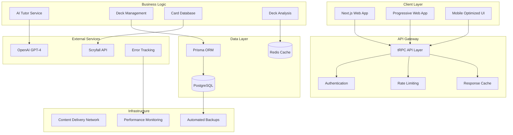

# Production-Ready AI Deck Building Tutor Design

## Overview

This design document outlines the architecture and implementation approach for transforming the existing AI Deck Building Tutor into a production-ready application. The focus is on reliability, performance, user experience, and scalability while maintaining the core AI-powered deck generation functionality.

## Architecture

### System Architecture Overview



### Core Components

#### 1. Enhanced Card Database Service

```typescript
interface CardDatabaseService {
  // Card data management
  syncFromScryfall(): Promise<SyncResult>
  getCard(cardId: string): Promise<Card | null>
  searchCards(query: CardSearchQuery): Promise<CardSearchResult>
  
  // Image management
  getCardImage(cardId: string, size: ImageSize): Promise<string>
  preloadImages(cardIds: string[]): Promise<void>
  
  // Format legality
  isLegalInFormat(cardId: string, format: string): boolean
  getFormatLegality(cardId: string): FormatLegality
  
  // Price data
  getCurrentPrice(cardId: string): Promise<PriceData | null>
  getPriceHistory(cardId: string): Promise<PriceHistory>
}

interface Card {
  id: string
  name: string
  manaCost: string
  cmc: number
  typeLine: string
  oracleText: string
  colors: string[]
  colorIdentity: string[]
  legalities: Record<string, string>
  imageUris: Record<string, string>
  prices: PriceData
  lastUpdated: Date
}
```

#### 2. Reliable AI Generation Service

```typescript
interface AIGenerationService {
  // Deck generation with retry logic
  generateFullDeck(request: DeckGenerationRequest): Promise<GeneratedDeck>
  
  // Commander suggestions
  suggestCommanders(preferences: CommanderPreferences): Promise<CommanderSuggestion[]>
  
  // Card recommendations
  recommendCards(context: RecommendationContext): Promise<CardRecommendation[]>
  
  // Quality validation
  validateDeckQuality(deck: GeneratedDeck): Promise<QualityReport>
}

interface DeckGenerationRequest {
  sessionId: string
  consultationData: ConsultationData
  constraints: GenerationConstraints
  retryCount?: number
}

interface GenerationConstraints {
  budget?: number
  powerLevel?: number
  useCollection?: boolean
  timeoutMs: number
  maxRetries: number
}

interface QualityReport {
  isValid: boolean
  cardCount: number
  manaCurveScore: number
  synergyScore: number
  budgetCompliance: number
  issues: QualityIssue[]
  suggestions: string[]
}
```

#### 3. Performance Optimization Layer

```typescript
interface PerformanceService {
  // Caching strategies
  cacheManager: CacheManager
  
  // Image optimization
  optimizeImages(images: ImageRequest[]): Promise<OptimizedImage[]>
  
  // Bundle optimization
  preloadCriticalResources(): Promise<void>
  
  // Database optimization
  optimizeQueries(): Promise<QueryOptimization[]>
}

interface CacheManager {
  // Deck analysis caching
  getDeckAnalysis(deckId: string): Promise<DeckAnalysis | null>
  setDeckAnalysis(deckId: string, analysis: DeckAnalysis, ttl: number): Promise<void>
  
  // Card data caching
  getCardData(cardId: string): Promise<Card | null>
  setCardData(cardId: string, card: Card, ttl: number): Promise<void>
  
  // User session caching
  getConsultationSession(sessionId: string): Promise<ConsultationSession | null>
  setConsultationSession(sessionId: string, session: ConsultationSession): Promise<void>
  
  // Cache invalidation
  invalidatePattern(pattern: string): Promise<void>
  clearExpired(): Promise<number>
}
```

#### 4. Monitoring and Observability

```typescript
interface MonitoringService {
  // Error tracking
  captureError(error: Error, context: ErrorContext): void
  captureMessage(message: string, level: LogLevel): void
  
  // Performance monitoring
  startTransaction(name: string): Transaction
  recordMetric(name: string, value: number, tags?: Record<string, string>): void
  
  // Health checks
  checkSystemHealth(): Promise<HealthStatus>
  checkDependencyHealth(): Promise<DependencyHealth[]>
  
  // User analytics
  trackUserAction(action: UserAction): void
  trackDeckGeneration(generation: DeckGenerationEvent): void
}

interface HealthStatus {
  status: 'healthy' | 'degraded' | 'unhealthy'
  timestamp: Date
  services: ServiceHealth[]
  metrics: SystemMetrics
}

interface ServiceHealth {
  name: string
  status: 'up' | 'down' | 'degraded'
  responseTime?: number
  lastCheck: Date
  error?: string
}
```

## Data Models

### Enhanced Database Schema

```sql
-- Card database with full Scryfall integration
CREATE TABLE cards (
  id TEXT PRIMARY KEY,
  name TEXT NOT NULL,
  mana_cost TEXT,
  cmc INTEGER NOT NULL DEFAULT 0,
  type_line TEXT NOT NULL,
  oracle_text TEXT,
  colors TEXT[] DEFAULT '{}',
  color_identity TEXT[] DEFAULT '{}',
  legalities JSONB DEFAULT '{}',
  image_uris JSONB DEFAULT '{}',
  prices JSONB DEFAULT '{}',
  scryfall_data JSONB,
  last_updated TIMESTAMP DEFAULT NOW(),
  
  -- Search optimization
  search_vector tsvector,
  
  -- Indexes for performance
  CONSTRAINT cards_name_unique UNIQUE (name)
);

-- Indexes for card searches
CREATE INDEX idx_cards_name ON cards USING gin(to_tsvector('english', name));
CREATE INDEX idx_cards_colors ON cards USING gin(colors);
CREATE INDEX idx_cards_color_identity ON cards USING gin(color_identity);
CREATE INDEX idx_cards_cmc ON cards (cmc);
CREATE INDEX idx_cards_type_line ON cards USING gin(to_tsvector('english', type_line));

-- Enhanced generated decks with quality metrics
CREATE TABLE generated_decks (
  id TEXT PRIMARY KEY,
  user_id TEXT REFERENCES users(id) ON DELETE CASCADE,
  session_id TEXT NOT NULL,
  name TEXT NOT NULL,
  commander TEXT NOT NULL,
  format TEXT DEFAULT 'commander',
  
  -- Strategy and context
  strategy JSONB NOT NULL,
  win_conditions JSONB NOT NULL,
  power_level INTEGER,
  estimated_budget DECIMAL(10,2),
  consultation_data JSONB NOT NULL,
  
  -- Quality metrics
  quality_score DECIMAL(3,2),
  mana_curve_score DECIMAL(3,2),
  synergy_score DECIMAL(3,2),
  budget_compliance DECIMAL(3,2),
  
  -- Generation metadata
  generation_time_ms INTEGER,
  ai_model_used TEXT,
  generation_prompt_hash TEXT,
  retry_count INTEGER DEFAULT 0,
  
  -- Status and timestamps
  status TEXT DEFAULT 'generated',
  created_at TIMESTAMP DEFAULT NOW(),
  updated_at TIMESTAMP DEFAULT NOW(),
  
  -- Indexes
  CONSTRAINT generated_decks_session_unique UNIQUE (session_id)
);

-- Performance monitoring table
CREATE TABLE performance_metrics (
  id SERIAL PRIMARY KEY,
  metric_name TEXT NOT NULL,
  metric_value DECIMAL(10,4) NOT NULL,
  tags JSONB DEFAULT '{}',
  timestamp TIMESTAMP DEFAULT NOW(),
  
  -- Partitioning by date for performance
  PARTITION BY RANGE (timestamp)
);

-- Error tracking table
CREATE TABLE error_logs (
  id SERIAL PRIMARY KEY,
  error_type TEXT NOT NULL,
  error_message TEXT NOT NULL,
  stack_trace TEXT,
  context JSONB DEFAULT '{}',
  user_id TEXT REFERENCES users(id),
  session_id TEXT,
  resolved BOOLEAN DEFAULT FALSE,
  created_at TIMESTAMP DEFAULT NOW()
);
```

### TypeScript Interfaces

```typescript
// Enhanced consultation data with validation
interface ConsultationData {
  // Core preferences
  buildingFullDeck: boolean
  needsCommanderSuggestions: boolean
  commander?: string
  
  // Strategy preferences
  strategy?: DeckStrategy
  themes?: string[]
  customTheme?: string
  
  // Constraints
  budget?: number
  powerLevel?: PowerLevel
  useCollection?: boolean
  
  // Advanced preferences
  colorPreferences?: ColorPreference[]
  winConditions?: WinConditionPreferences
  interaction?: InteractionPreferences
  complexity?: ComplexityLevel
  
  // Restrictions
  avoidStrategies?: string[]
  avoidCards?: string[]
  petCards?: string[]
  
  // Validation metadata
  isValid: boolean
  validationErrors: ValidationError[]
  completionPercentage: number
}

// Enhanced generated deck with quality metrics
interface GeneratedDeck {
  id: string
  userId: string
  sessionId: string
  name: string
  commander: string
  format: string
  
  // Strategy context
  strategy: DeckStrategy
  winConditions: WinCondition[]
  powerLevel: number
  estimatedBudget: number
  
  // Cards and analysis
  cards: GeneratedDeckCard[]
  statistics: DeckStatistics
  synergies: CardSynergy[]
  qualityMetrics: QualityMetrics
  
  // Generation metadata
  generationTime: number
  aiModelUsed: string
  retryCount: number
  
  // Timestamps
  createdAt: Date
  updatedAt: Date
}

// Quality metrics for generated decks
interface QualityMetrics {
  overallScore: number // 0-1
  manaCurveScore: number
  synergyScore: number
  budgetCompliance: number
  powerLevelAccuracy: number
  
  // Detailed analysis
  cardCategoryDistribution: CategoryDistribution
  manaCurveAnalysis: ManaCurveAnalysis
  colorConsistency: ColorConsistency
  
  // Issues and suggestions
  issues: QualityIssue[]
  suggestions: ImprovementSuggestion[]
}
```

## Implementation Strategy

### Phase 1: Infrastructure and Reliability

#### Database Optimization
```typescript
// Implement connection pooling and query optimization
const prisma = new PrismaClient({
  datasources: {
    db: {
      url: process.env.DATABASE_URL,
    },
  },
  log: ['query', 'info', 'warn', 'error'],
})

// Add query performance monitoring
prisma.$use(async (params, next) => {
  const before = Date.now()
  const result = await next(params)
  const after = Date.now()
  
  console.log(`Query ${params.model}.${params.action} took ${after - before}ms`)
  
  // Log slow queries
  if (after - before > 1000) {
    console.warn('Slow query detected:', params)
  }
  
  return result
})
```

#### Error Handling and Monitoring
```typescript
// Comprehensive error boundary
class ProductionErrorBoundary extends Component<Props, State> {
  constructor(props: Props) {
    super(props)
    this.state = { hasError: false, error: null }
  }
  
  static getDerivedStateFromError(error: Error): State {
    return { hasError: true, error }
  }
  
  componentDidCatch(error: Error, errorInfo: ErrorInfo) {
    // Log to monitoring service
    monitoringService.captureError(error, {
      component: this.constructor.name,
      errorInfo,
      userId: this.props.userId,
      sessionId: this.props.sessionId,
    })
    
    // Track error metrics
    monitoringService.recordMetric('error.boundary.triggered', 1, {
      component: this.constructor.name,
      errorType: error.name,
    })
  }
  
  render() {
    if (this.state.hasError) {
      return (
        <ErrorFallback
          error={this.state.error}
          onRetry={() => this.setState({ hasError: false, error: null })}
          onReport={() => this.reportError()}
        />
      )
    }
    
    return this.props.children
  }
}
```

#### Caching Implementation
```typescript
// Multi-layer caching strategy
class CacheService {
  private redis: Redis
  private memoryCache: Map<string, CacheEntry>
  
  constructor() {
    this.redis = new Redis(process.env.REDIS_URL!)
    this.memoryCache = new Map()
  }
  
  async get<T>(key: string): Promise<T | null> {
    // Check memory cache first (fastest)
    const memoryEntry = this.memoryCache.get(key)
    if (memoryEntry && !this.isExpired(memoryEntry)) {
      return memoryEntry.value as T
    }
    
    // Check Redis cache (fast)
    const redisValue = await this.redis.get(key)
    if (redisValue) {
      const parsed = JSON.parse(redisValue) as T
      
      // Update memory cache
      this.memoryCache.set(key, {
        value: parsed,
        expiresAt: Date.now() + 60000, // 1 minute in memory
      })
      
      return parsed
    }
    
    return null
  }
  
  async set<T>(key: string, value: T, ttlSeconds: number): Promise<void> {
    // Set in Redis with TTL
    await this.redis.setex(key, ttlSeconds, JSON.stringify(value))
    
    // Set in memory cache with shorter TTL
    this.memoryCache.set(key, {
      value,
      expiresAt: Date.now() + Math.min(ttlSeconds * 1000, 60000),
    })
  }
  
  private isExpired(entry: CacheEntry): boolean {
    return Date.now() > entry.expiresAt
  }
}
```

### Phase 2: AI Service Reliability

#### Robust AI Generation
```typescript
class ReliableAIService {
  private openai: OpenAI
  private retryConfig: RetryConfig
  private circuitBreaker: CircuitBreaker
  
  constructor() {
    this.openai = new OpenAI({
      apiKey: process.env.OPENAI_API_KEY!,
      timeout: 120000, // 2 minutes
    })
    
    this.retryConfig = {
      maxRetries: 3,
      baseDelay: 1000,
      maxDelay: 10000,
      backoffFactor: 2,
    }
    
    this.circuitBreaker = new CircuitBreaker({
      failureThreshold: 5,
      resetTimeout: 60000,
    })
  }
  
  async generateDeck(request: DeckGenerationRequest): Promise<GeneratedDeck> {
    return this.circuitBreaker.execute(async () => {
      return this.retryWithBackoff(async () => {
        const startTime = Date.now()
        
        try {
          // Generate deck with timeout
          const result = await Promise.race([
            this.performGeneration(request),
            this.timeoutPromise(request.constraints.timeoutMs),
          ])
          
          // Record success metrics
          monitoringService.recordMetric('ai.generation.success', 1)
          monitoringService.recordMetric('ai.generation.duration', Date.now() - startTime)
          
          return result
        } catch (error) {
          // Record failure metrics
          monitoringService.recordMetric('ai.generation.failure', 1)
          monitoringService.captureError(error as Error, {
            sessionId: request.sessionId,
            retryCount: request.retryCount || 0,
          })
          
          throw error
        }
      })
    })
  }
  
  private async retryWithBackoff<T>(operation: () => Promise<T>): Promise<T> {
    let lastError: Error
    
    for (let attempt = 0; attempt <= this.retryConfig.maxRetries; attempt++) {
      try {
        return await operation()
      } catch (error) {
        lastError = error as Error
        
        if (attempt === this.retryConfig.maxRetries) {
          throw lastError
        }
        
        // Calculate delay with exponential backoff
        const delay = Math.min(
          this.retryConfig.baseDelay * Math.pow(this.retryConfig.backoffFactor, attempt),
          this.retryConfig.maxDelay
        )
        
        await this.sleep(delay)
      }
    }
    
    throw lastError!
  }
  
  private timeoutPromise(timeoutMs: number): Promise<never> {
    return new Promise((_, reject) => {
      setTimeout(() => reject(new Error('AI generation timeout')), timeoutMs)
    })
  }
}
```

### Phase 3: User Experience Enhancement

#### Progressive Loading
```typescript
// Progressive deck editor loading
const DeckEditor = dynamic(() => import('./DeckEditor'), {
  loading: () => <DeckEditorSkeleton />,
  ssr: false, // Client-side only for better performance
})

// Virtualized card lists for performance
const VirtualizedCardList: React.FC<CardListProps> = ({ cards, onCardSelect }) => {
  const [containerRef, setContainerRef] = useState<HTMLDivElement | null>(null)
  const [containerHeight, setContainerHeight] = useState(600)
  
  const rowVirtualizer = useVirtualizer({
    count: cards.length,
    getScrollElement: () => containerRef,
    estimateSize: () => 80, // Estimated row height
    overscan: 10, // Render extra items for smooth scrolling
  })
  
  return (
    <div
      ref={setContainerRef}
      className="h-full overflow-auto"
      style={{ height: containerHeight }}
    >
      <div
        style={{
          height: `${rowVirtualizer.getTotalSize()}px`,
          width: '100%',
          position: 'relative',
        }}
      >
        {rowVirtualizer.getVirtualItems().map((virtualItem) => (
          <div
            key={virtualItem.key}
            style={{
              position: 'absolute',
              top: 0,
              left: 0,
              width: '100%',
              height: `${virtualItem.size}px`,
              transform: `translateY(${virtualItem.start}px)`,
            }}
          >
            <CardRow
              card={cards[virtualItem.index]}
              onSelect={onCardSelect}
            />
          </div>
        ))}
      </div>
    </div>
  )
}
```

#### Mobile Optimization
```typescript
// Touch-optimized consultation wizard
const MobileWizardStep: React.FC<WizardStepProps> = ({ step, onNext, onBack }) => {
  const [touchStart, setTouchStart] = useState<number | null>(null)
  const [touchEnd, setTouchEnd] = useState<number | null>(null)
  
  // Handle swipe gestures
  const handleTouchStart = (e: TouchEvent) => {
    setTouchEnd(null)
    setTouchStart(e.targetTouches[0].clientX)
  }
  
  const handleTouchMove = (e: TouchEvent) => {
    setTouchEnd(e.targetTouches[0].clientX)
  }
  
  const handleTouchEnd = () => {
    if (!touchStart || !touchEnd) return
    
    const distance = touchStart - touchEnd
    const isLeftSwipe = distance > 50
    const isRightSwipe = distance < -50
    
    if (isLeftSwipe && step.canGoNext) {
      onNext()
    }
    if (isRightSwipe && step.canGoBack) {
      onBack()
    }
  }
  
  return (
    <div
      className="touch-pan-y"
      onTouchStart={handleTouchStart}
      onTouchMove={handleTouchMove}
      onTouchEnd={handleTouchEnd}
    >
      <StepContent step={step} />
      
      {/* Touch-optimized navigation */}
      <div className="flex justify-between mt-8 px-4">
        <Button
          variant="outline"
          size="lg"
          onClick={onBack}
          disabled={!step.canGoBack}
          className="min-h-[48px] min-w-[120px]" // Touch-friendly sizing
        >
          Back
        </Button>
        
        <Button
          size="lg"
          onClick={onNext}
          disabled={!step.canGoNext}
          className="min-h-[48px] min-w-[120px]"
        >
          Next
        </Button>
      </div>
    </div>
  )
}
```

## Testing Strategy

### Comprehensive Test Coverage

```typescript
// Integration tests for AI generation
describe('AI Deck Generation', () => {
  it('should generate valid 100-card deck within time limit', async () => {
    const request: DeckGenerationRequest = {
      sessionId: 'test-session',
      consultationData: mockConsultationData,
      constraints: {
        budget: 500,
        powerLevel: 3,
        timeoutMs: 120000,
        maxRetries: 2,
      },
    }
    
    const startTime = Date.now()
    const deck = await aiService.generateDeck(request)
    const duration = Date.now() - startTime
    
    // Validate deck structure
    expect(deck.cards).toHaveLength(100)
    expect(deck.commander).toBeTruthy()
    expect(deck.estimatedBudget).toBeLessThanOrEqual(550) // 10% tolerance
    
    // Validate timing
    expect(duration).toBeLessThan(120000)
    
    // Validate quality
    expect(deck.qualityMetrics.overallScore).toBeGreaterThan(0.7)
  })
  
  it('should handle AI service failures gracefully', async () => {
    // Mock AI service failure
    jest.spyOn(openai.chat.completions, 'create').mockRejectedValue(
      new Error('OpenAI API unavailable')
    )
    
    const request: DeckGenerationRequest = {
      sessionId: 'test-session',
      consultationData: mockConsultationData,
      constraints: { maxRetries: 1 },
    }
    
    await expect(aiService.generateDeck(request)).rejects.toThrow()
    
    // Verify error was logged
    expect(monitoringService.captureError).toHaveBeenCalled()
  })
})

// Performance tests
describe('Performance Requirements', () => {
  it('should load homepage within 3 seconds', async ({ page }) => {
    const startTime = Date.now()
    await page.goto('/')
    await page.waitForSelector('[data-testid="homepage-loaded"]')
    const loadTime = Date.now() - startTime
    
    expect(loadTime).toBeLessThan(3000)
  })
  
  it('should handle 100 concurrent deck generations', async () => {
    const requests = Array.from({ length: 100 }, (_, i) => ({
      sessionId: `test-session-${i}`,
      consultationData: mockConsultationData,
      constraints: { timeoutMs: 60000 },
    }))
    
    const startTime = Date.now()
    const results = await Promise.allSettled(
      requests.map(req => aiService.generateDeck(req))
    )
    const duration = Date.now() - startTime
    
    const successful = results.filter(r => r.status === 'fulfilled').length
    const successRate = successful / requests.length
    
    expect(successRate).toBeGreaterThan(0.95) // 95% success rate
    expect(duration).toBeLessThan(300000) // 5 minutes total
  })
})
```

## Deployment and Operations

### Production Deployment Pipeline

```yaml
# .github/workflows/production-deploy.yml
name: Production Deployment

on:
  push:
    branches: [main]

jobs:
  test:
    runs-on: ubuntu-latest
    steps:
      - uses: actions/checkout@v3
      - uses: actions/setup-node@v3
        with:
          node-version: '20'
          cache: 'pnpm'
      
      - run: pnpm install
      - run: pnpm test
      - run: pnpm test:e2e
      - run: pnpm type-check
      - run: pnpm build
  
  deploy:
    needs: test
    runs-on: ubuntu-latest
    steps:
      - uses: actions/checkout@v3
      
      # Database migrations
      - name: Run Database Migrations
        run: npx prisma migrate deploy
        env:
          DATABASE_URL: ${{ secrets.DATABASE_URL }}
      
      # Deploy to Vercel
      - name: Deploy to Vercel
        uses: amondnet/vercel-action@v25
        with:
          vercel-token: ${{ secrets.VERCEL_TOKEN }}
          vercel-org-id: ${{ secrets.VERCEL_ORG_ID }}
          vercel-project-id: ${{ secrets.VERCEL_PROJECT_ID }}
          vercel-args: '--prod'
      
      # Health check
      - name: Health Check
        run: |
          sleep 30
          curl -f https://moxmuse.com/api/health || exit 1
      
      # Notify team
      - name: Notify Deployment
        uses: 8398a7/action-slack@v3
        with:
          status: ${{ job.status }}
          text: 'Production deployment completed successfully'
        env:
          SLACK_WEBHOOK_URL: ${{ secrets.SLACK_WEBHOOK }}
```

This design provides a comprehensive foundation for a production-ready AI Deck Building Tutor that prioritizes reliability, performance, and user experience while maintaining the core AI-powered functionality.