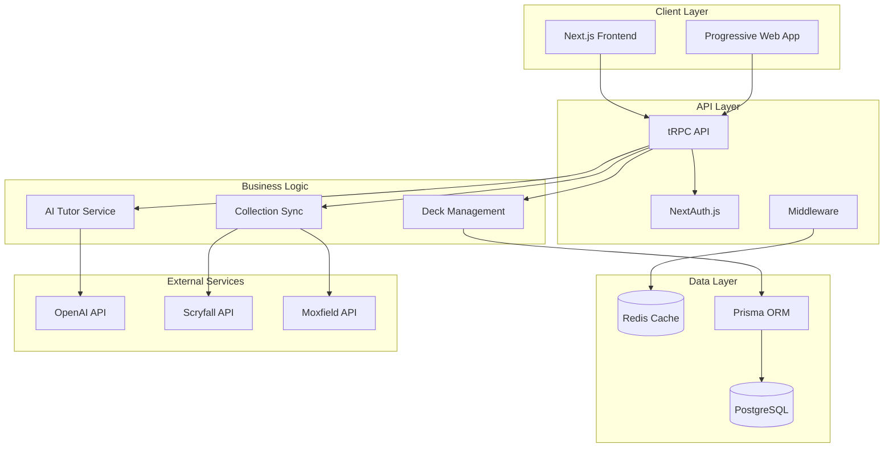

# MoxMuse Architecture

This document describes the system architecture, design patterns, and technical decisions behind MoxMuse.

## System Overview

MoxMuse is a modern web application built with a focus on AI-powered deck building for Magic: The Gathering Commander format. The architecture prioritizes developer experience, type safety, and scalable AI integration.

### High-Level Architecture



## Technology Stack

### Frontend
- **Next.js 14** - React framework with App Router
- **React 18** - UI library with concurrent features
- **TypeScript** - Type safety and developer experience
- **Tailwind CSS** - Utility-first styling
- **Radix UI** - Accessible component primitives
- **Framer Motion** - Animations and transitions

### Backend
- **tRPC** - End-to-end type-safe APIs
- **Prisma** - Type-safe database ORM
- **NextAuth.js** - Authentication and session management
- **Zod** - Runtime type validation

### Database & Caching
- **PostgreSQL** - Primary database
- **Redis** - Caching and session storage
- **Prisma Client** - Database access layer

### External Services
- **OpenAI GPT-4** - AI deck generation and recommendations
- **Scryfall API** - Magic card database
- **Moxfield API** - Collection import/export

## Core Modules

### 1. AI Deck Building Tutor

The flagship feature that guides users through complete deck creation.

#### Components
```typescript
// Entry point selection
EntryPointSelector -> DeckBuildingOption | CardRecommendationOption

// Consultation wizard
DeckBuildingWizard -> WizardStep[] -> ConsultationData

// Commander selection
CommanderSelection -> AICommanderGenerator -> CommanderRecommendation[]

// Deck generation
DeckGenerationEngine -> OpenAIService -> GeneratedDeck

// Deck editing
DeckEditor -> InteractiveStatistics -> CardManagement
```

#### Data Flow
1. **User Input** - Preferences collected through wizard
2. **AI Processing** - OpenAI generates recommendations
3. **Deck Assembly** - Cards organized into structured deck
4. **Analysis** - Statistics and synergies calculated
5. **Editing** - User refines deck with AI assistance

### 2. Database Schema

#### Core Entities
```sql
-- User management
users -> accounts, sessions

-- Deck generation
generated_decks -> generated_deck_cards
consultation_sessions -> generated_decks
deck_analysis -> generated_decks

-- Collection management
collection_cards -> users
collection_sources -> users
sync_jobs -> users

-- Social features
public_decks -> deck_comments, deck_likes
user_profiles -> user_follows
```

#### Key Relationships
- **User** has many **GeneratedDecks**
- **GeneratedDeck** has many **GeneratedDeckCards**
- **ConsultationSession** creates **GeneratedDeck**
- **DeckAnalysis** caches **GeneratedDeck** statistics

### 3. API Design

#### tRPC Router Structure
```typescript
export const appRouter = createTRPCRouter({
  // AI-powered features
  tutor: tutorRouter,
  
  // Core deck management
  deck: deckRouter,
  
  // User and authentication
  user: userRouter,
  
  // Collection management
  collection: collectionRouter,
})
```

#### Key Procedures
```typescript
// Tutor router
tutor: {
  generateFullDeck: protectedProcedure,
  getCommanderSuggestions: protectedProcedure,
  analyzeDeck: protectedProcedure,
  recommendAndLink: protectedProcedure,
}

// Deck router
deck: {
  create: protectedProcedure,
  update: protectedProcedure,
  delete: protectedProcedure,
  getById: protectedProcedure,
  list: protectedProcedure,
}
```

## Design Patterns

### 1. Type Safety

#### End-to-End Types
```typescript
// Shared types across client and server
interface ConsultationData {
  buildingFullDeck: boolean
  commander?: string
  strategy?: DeckStrategy
  budget?: number
  powerLevel?: number
}

// tRPC ensures type safety
const consultation = trpc.tutor.generateFullDeck.useMutation({
  onSuccess: (deck: GeneratedDeck) => {
    // TypeScript knows the exact shape
  }
})
```

#### Runtime Validation
```typescript
// Zod schemas for runtime validation
const ConsultationDataSchema = z.object({
  buildingFullDeck: z.boolean(),
  commander: z.string().optional(),
  strategy: z.enum(['aggro', 'control', 'combo']).optional(),
  budget: z.number().positive().optional(),
})

// Used in tRPC procedures
.input(ConsultationDataSchema)
```

### 2. Component Architecture

#### Composition Pattern
```typescript
// Composable components
<DeckEditor>
  <DeckHeader />
  <DeckCardList />
  <DeckStatisticsSidebar>
    <InteractiveManaCurve />
    <ColorDistributionPie />
    <TypeDistribution />
  </DeckStatisticsSidebar>
</DeckEditor>
```

#### Custom Hooks
```typescript
// Reusable business logic
const useDeckGeneration = (consultationData: ConsultationData) => {
  const [progress, setProgress] = useState(0)
  const [phase, setPhase] = useState('')
  
  const generateDeck = useCallback(async () => {
    // Complex generation logic
  }, [consultationData])
  
  return { progress, phase, generateDeck }
}
```

### 3. State Management

#### Server State (tRPC + React Query)
```typescript
// Automatic caching and synchronization
const { data: deck, isLoading } = trpc.deck.getById.useQuery({
  id: deckId
})

const updateDeck = trpc.deck.update.useMutation({
  onSuccess: () => {
    // Automatic cache invalidation
    utils.deck.getById.invalidate({ id: deckId })
  }
})
```

#### Client State (React Context)
```typescript
// Shared UI state
const DeckContext = createContext<{
  activeDeck: GeneratedDeck | null
  setActiveDeck: (deck: GeneratedDeck) => void
}>()

const useDeck = () => {
  const context = useContext(DeckContext)
  if (!context) throw new Error('useDeck must be used within DeckProvider')
  return context
}
```

### 4. Error Handling

#### Error Boundaries
```typescript
class ErrorBoundary extends Component {
  componentDidCatch(error: Error, errorInfo: ErrorInfo) {
    // Log to monitoring service
    console.error('Component error:', error, errorInfo)
  }
  
  render() {
    if (this.state.hasError) {
      return <ErrorFallback />
    }
    return this.props.children
  }
}
```

#### API Error Handling
```typescript
const mutation = trpc.tutor.generateFullDeck.useMutation({
  onError: (error) => {
    if (error.code === 'UNAUTHORIZED') {
      router.push('/auth/signin')
    } else if (error.code === 'RATE_LIMITED') {
      showToast('Please wait before generating another deck')
    } else {
      showToast('An unexpected error occurred')
    }
  }
})
```

## Performance Optimizations

### 1. Code Splitting
```typescript
// Dynamic imports for large components
const DeckEditor = dynamic(() => import('./DeckEditor'), {
  loading: () => <DeckEditorSkeleton />
})

// Route-based splitting (automatic with Next.js App Router)
app/
├── page.tsx                 # Home page bundle
├── tutor/page.tsx          # Tutor page bundle
└── decks/page.tsx          # Decks page bundle
```

### 2. Database Optimization
```typescript
// Efficient queries with Prisma
const deck = await prisma.generatedDeck.findUnique({
  where: { id },
  include: {
    cards: {
      select: {
        cardId: true,
        quantity: true,
        category: true,
      }
    },
    analysis: true,
  }
})

// Database indexes for common queries
@@index([userId, createdAt])
@@index([sessionId])
@@index([status])
```

### 3. Caching Strategy
```typescript
// React Query caching
const queryClient = new QueryClient({
  defaultOptions: {
    queries: {
      staleTime: 5 * 60 * 1000, // 5 minutes
      cacheTime: 10 * 60 * 1000, // 10 minutes
    }
  }
})

// Redis caching for expensive operations
const getCachedDeckAnalysis = async (deckId: string) => {
  const cached = await redis.get(`deck:analysis:${deckId}`)
  if (cached) return JSON.parse(cached)
  
  const analysis = await calculateDeckAnalysis(deckId)
  await redis.setex(`deck:analysis:${deckId}`, 3600, JSON.stringify(analysis))
  return analysis
}
```

### 4. Image Optimization
```typescript
// Next.js Image component with optimization
<Image
  src={cardImageUrl}
  alt={cardName}
  width={200}
  height={280}
  placeholder="blur"
  blurDataURL="data:image/jpeg;base64,..."
  loading="lazy"
/>

// Progressive image loading
const useProgressiveImage = (src: string) => {
  const [imgSrc, setImgSrc] = useState(lowQualitySrc)
  
  useEffect(() => {
    const img = new Image()
    img.src = src
    img.onload = () => setImgSrc(src)
  }, [src])
  
  return imgSrc
}
```

## Security Considerations

### 1. Authentication & Authorization
```typescript
// Protected tRPC procedures
export const protectedProcedure = publicProcedure.use(({ ctx, next }) => {
  if (!ctx.session?.user) {
    throw new TRPCError({ code: 'UNAUTHORIZED' })
  }
  return next({
    ctx: {
      session: ctx.session,
      user: ctx.session.user,
    }
  })
})
```

### 2. Input Validation
```typescript
// Zod validation for all inputs
const createDeckInput = z.object({
  name: z.string().min(1).max(100),
  format: z.enum(['commander', 'standard', 'modern']),
  description: z.string().max(1000).optional(),
})

// SQL injection prevention (Prisma)
const deck = await prisma.deck.findMany({
  where: {
    userId: ctx.user.id, // Parameterized query
    name: { contains: searchTerm } // Safe string operations
  }
})
```

### 3. Rate Limiting
```typescript
// API rate limiting
const rateLimiter = rateLimit({
  windowMs: 15 * 60 * 1000, // 15 minutes
  max: 100, // Limit each IP to 100 requests per windowMs
  message: 'Too many requests from this IP'
})

// AI service rate limiting
const aiRateLimiter = rateLimit({
  windowMs: 60 * 1000, // 1 minute
  max: 5, // 5 AI requests per minute
  keyGenerator: (req) => req.user?.id || req.ip
})
```

## Deployment Architecture

### Production Environment
```yaml
# Docker Compose example
version: '3.8'
services:
  web:
    build: .
    ports:
      - "3000:3000"
    environment:
      - DATABASE_URL
      - NEXTAUTH_SECRET
      - OPENAI_API_KEY
    depends_on:
      - db
      - redis
  
  db:
    image: postgres:15
    environment:
      - POSTGRES_DB=moxmuse
      - POSTGRES_USER=moxmuse
      - POSTGRES_PASSWORD=${DB_PASSWORD}
    volumes:
      - postgres_data:/var/lib/postgresql/data
  
  redis:
    image: redis:7-alpine
    volumes:
      - redis_data:/data
```

### Monitoring & Observability
```typescript
// Error tracking
import * as Sentry from '@sentry/nextjs'

Sentry.init({
  dsn: process.env.SENTRY_DSN,
  environment: process.env.NODE_ENV,
})

// Performance monitoring
import { Analytics } from '@vercel/analytics/react'

export default function App() {
  return (
    <>
      <Component {...pageProps} />
      <Analytics />
    </>
  )
}
```

## Future Considerations

### Scalability
- **Microservices**: Split AI services into separate deployments
- **CDN**: Serve static assets from edge locations
- **Database Sharding**: Partition data by user or region
- **Caching Layers**: Multi-level caching strategy

### AI Enhancements
- **Model Fine-tuning**: Custom models for Magic-specific tasks
- **Embeddings**: Vector search for card similarity
- **Real-time Learning**: Adapt to user preferences over time
- **Multi-modal AI**: Image recognition for card scanning

### Mobile Experience
- **Progressive Web App**: Offline capabilities
- **Native Apps**: React Native for iOS/Android
- **Touch Optimization**: Gesture-based interactions
- **Performance**: Optimized for mobile networks

This architecture provides a solid foundation for MoxMuse while remaining flexible for future enhancements and scaling needs.

## Implementation Focus

For current priorities and scope boundaries, see `IMPLEMENTATION_FOCUS.md` (or integrate its content into this architecture document if you prefer a single source). The focus is on launching a production-ready AI Deck Building Tutor with reliability, performance, and monitoring.