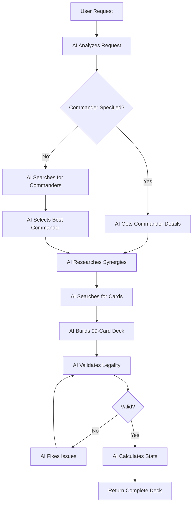

# AI-First Deck Generation Implementation Guide

## Overview

This implementation represents a true AI-first approach to Commander deck generation where the AI has complete autonomy to research, select cards, and validate decks.

## Architecture

### Core Principle: AI as the Primary Agent

Instead of:
```
Database Query → Filter Cards → AI Scores → Assembly
```

We now have:
```
AI Agent → Uses Tools → Researches → Builds → Validates
```

## Key Components

### 1. AI-First Deck Generator (`deck-generator-ai-first.ts`)

The main class that orchestrates AI-driven deck generation:

```typescript
export class AIFirstDeckGenerator {
  // AI has access to:
  private openai: OpenAI;           // GPT-4 with function calling
  private cardDb: CompleteCardDatabase;  // Full card database access
  
  // AI can use these tools autonomously:
  - search_cards: Search with any criteria
  - get_card_details: Get full card information
  - research_commander_synergies: Analyze strategies
  - validate_deck_legality: Check Commander rules
  - calculate_deck_stats: Analyze deck composition
}
```

### 2. Function Calling Tools

The AI has autonomous access to these tools:

#### `search_cards`
```typescript
// AI can search with:
{
  query: string,              // Text search
  colorIdentity: string[],    // Color restrictions
  types: string[],           // Card types
  cmc: { min, max },         // Mana cost range
  keywords: string[],        // Ability keywords
  limit: number              // Result limit
}
```

#### `get_card_details`
```typescript
// Get complete information about any card
{
  cardName: string
}
```

#### `research_commander_synergies`
```typescript
// Analyze a commander and find synergistic cards
{
  commanderName: string
}
```

#### `validate_deck_legality`
```typescript
// Ensure deck follows all Commander rules
{
  commander: string,
  mainboard: string[]  // 99 cards
}
```

#### `calculate_deck_stats`
```typescript
// Analyze deck composition
{
  cards: string[]
}
```

## Implementation Details

### 1. Complete Commander Rules Knowledge

The AI is given comprehensive Commander/EDH rules:

```typescript
const COMMANDER_RULES = `
1. Deck Construction:
   - Exactly 100 cards total (1 commander + 99 other cards)
   - Singleton format: Only one copy of each card (except basic lands)
   - Color Identity: All cards must only contain mana symbols in the commander's color identity

2. Color Identity Rules:
   - Determined by all mana symbols in the commander's mana cost AND rules text
   - Hybrid mana symbols count as BOTH colors
   - Cards with no mana symbols are colorless

3. Legal Commanders:
   - Must be a Legendary Creature
   - Some cards explicitly state "can be your commander"
   - Partner commanders allow two commanders

4. Banned Cards: [Full ban list provided]

5. Special Cases:
   - Basic lands have no limit
   - Relentless Rats and similar cards override singleton rule
`;
```

### 2. AI Process Flow



### 3. Database Integration

The AI uses the existing `CompleteCardDatabase` which provides:

- **99,267 Commander-legal cards**
- **Instant access** (no API calls)
- **Rich search capabilities**
- **Price and popularity data**

### 4. Request Types Supported

#### Basic Request
```typescript
{
  userRequest: "Build me a fun token deck"
}
```

#### Specific Commander
```typescript
{
  commanderName: "Teysa Karlov",
  userRequest: "Build an aristocrats deck",
  constraints: {
    mustInclude: ["Blood Artist"],
    budget: 200
  }
}
```

#### AI Commander Selection
```typescript
{
  userRequest: "I want to play control in blue/white",
  constraints: {
    powerLevel: 8
  }
}
```

## Key Advantages

### 1. True AI Autonomy
- AI controls the entire process
- Can make intelligent decisions at each step
- Validates its own work

### 2. Deep Understanding
- AI understands Commander rules completely
- Can research strategies and synergies
- Makes contextual card selections

### 3. Flexible Requests
- Natural language processing
- Can handle vague or specific requests
- Suggests commanders when needed

### 4. Self-Validation
- Checks color identity
- Ensures singleton format
- Validates against ban list
- Confirms exactly 99 cards

## Usage Examples

### Example 1: Full Autonomy
```javascript
const deck = await generator.generateDeck({
  userRequest: "Build me a deck that wins through combat damage with lots of creatures"
});
```

### Example 2: Specific Requirements
```javascript
const deck = await generator.generateDeck({
  commanderName: "Atraxa, Praetors' Voice",
  userRequest: "Focus on +1/+1 counters and proliferate",
  constraints: {
    budget: 500,
    powerLevel: 8,
    mustInclude: ["Doubling Season", "Hardened Scales"]
  }
});
```

### Example 3: Help Me Choose
```javascript
const deck = await generator.generateDeck({
  userRequest: "I'm new to Commander. Build me an easy to play green deck that ramps into big creatures. Help me pick a good commander.",
  constraints: {
    budget: 100,
    powerLevel: 5
  }
});
```

## Testing

Run the test script to see the AI-first approach in action:

```bash
npx ts-node test-ai-first-deck-generation.ts
```

This will demonstrate:
1. Full AI autonomy with vague requests
2. Specific commander deck building
3. AI commander selection and deck building

## Future Enhancements

### 1. Web Search Integration
Allow AI to research current meta and prices:
```typescript
tools.push({
  name: 'search_edhrec',
  description: 'Get current meta data for commanders'
});
```

### 2. Collection Integration
Consider user's existing collection:
```typescript
constraints: {
  preferOwnedCards: true,
  ownedCards: [...userCollection]
}
```

### 3. Iterative Refinement
Allow AI to refine based on feedback:
```typescript
const refinedDeck = await generator.refineDeck(
  originalDeck,
  "Add more card draw and remove some high-cost cards"
);
```

### 4. Meta Analysis
AI analyzes local meta and adapts:
```typescript
constraints: {
  localMeta: {
    commonCommanders: ["Yuriko", "Kinnan"],
    needsAnswersFor: ["combo", "aggro"]
  }
}
```

## Conclusion

This AI-first architecture represents the future of deck building where AI acts as an intelligent assistant that truly understands the game, researches options, and builds complete, legal, and synergistic decks based on natural language requests.

The key insight: **Give AI the tools and knowledge, then let it do what it does best - research, analyze, and create.**
