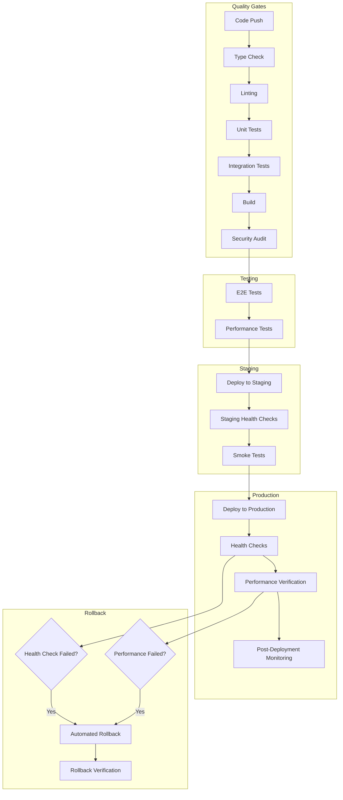

# Production Deployment Pipeline

This document describes the comprehensive deployment pipeline for the MTG Deck Building Tutor application.

## Overview

The deployment pipeline implements a robust CI/CD process with quality gates, staging environment, blue-green deployment strategy, automated rollback, and comprehensive monitoring.

## Pipeline Architecture



## Workflow Stages

### 1. Quality Gates

**Triggers:** Push to `main` branch or Pull Request

**Steps:**
- Type checking with TypeScript
- Code linting with ESLint
- Unit tests with Vitest
- Integration tests
- Application build
- Security audit with `pnpm audit`
- Bundle analysis

**Success Criteria:**
- All type checks pass
- No linting errors
- 90%+ test coverage
- Build completes successfully
- No high/critical security vulnerabilities

### 2. End-to-End Testing

**Environment:** Isolated test environment with PostgreSQL

**Steps:**
- Database setup and migrations
- Playwright browser tests
- Critical user journey validation
- Accessibility compliance testing

**Success Criteria:**
- All E2E tests pass
- No critical accessibility violations
- User journeys complete within performance thresholds

### 3. Performance Testing

**Steps:**
- Load testing with realistic scenarios
- Memory usage profiling
- Database query performance analysis
- API response time validation

**Success Criteria:**
- Response times < 2 seconds (P95)
- Memory usage within limits
- Database queries optimized
- No performance regressions

### 4. Staging Deployment

**Environment:** `staging` (Vercel Preview)

**Steps:**
- Deploy to Vercel staging environment
- Run database migrations
- Execute health checks
- Run smoke tests
- Generate staging URL for manual testing

**Success Criteria:**
- Deployment completes successfully
- All health checks pass
- Smoke tests pass
- Staging environment accessible

### 5. Production Deployment

**Environment:** `production` (Vercel Production)

**Strategy:** Blue-Green Deployment

**Steps:**
- Pre-deployment health check
- Database migrations (if any)
- Deploy to production (new version)
- Wait for propagation (60 seconds)
- Comprehensive health checks
- Performance verification with Lighthouse
- Enable monitoring alerts

**Success Criteria:**
- Deployment completes without errors
- All health checks pass
- Performance metrics within thresholds
- No critical errors in monitoring

### 6. Automated Rollback

**Triggers:**
- Health check failures
- Performance degradation
- Critical error rate exceeded

**Process:**
1. Detect failure condition
2. Identify previous stable deployment
3. Execute rollback to previous version
4. Verify rollback success
5. Send notifications to team
6. Enable enhanced monitoring

**Verification:**
- Health checks pass after rollback
- Error rates return to normal
- Performance metrics stabilize

### 7. Post-Deployment Monitoring

**Duration:** 2 hours enhanced monitoring

**Metrics Tracked:**
- Error rate (< 1%)
- Availability (> 99.9%)
- Response time P95 (< 2 seconds)
- User journey success rate
- Database performance

**Alerting:**
- Slack notifications for threshold breaches
- Automated escalation for critical issues
- Performance regression detection

## Environment Configuration

### Staging Environment

- **URL:** `https://staging.moxmuse.com`
- **Database:** Staging PostgreSQL instance
- **Monitoring:** Basic health checks
- **Purpose:** Pre-production testing and validation

### Production Environment

- **URL:** `https://moxmuse.com`
- **Database:** Production PostgreSQL with backups
- **Monitoring:** Full observability stack
- **Purpose:** Live user-facing application

## Required Secrets

Configure these secrets in GitHub repository settings:

### Vercel Configuration
- `VERCEL_TOKEN` - Vercel API token
- `VERCEL_ORG_ID` - Vercel organization ID
- `VERCEL_PROJECT_ID` - Vercel project ID

### Database
- `DATABASE_URL` - Production database connection string
- `STAGING_DATABASE_URL` - Staging database connection string
- `TEST_DATABASE_URL` - Test database connection string

### Authentication
- `NEXTAUTH_SECRET` - Production NextAuth secret
- `STAGING_NEXTAUTH_SECRET` - Staging NextAuth secret

### External Services
- `OPENAI_API_KEY` - OpenAI API key for AI features
- `SENTRY_DSN` - Sentry error tracking DSN

### Notifications
- `SLACK_WEBHOOK` - Slack webhook for deployment notifications
- `MONITORING_API_KEY` - Monitoring service API key

## Manual Operations

### Health Check

```bash
# Check deployment health
pnpm deployment:health-check https://moxmuse.com

# Check with custom timeout and retries
node scripts/deployment/health-check.js https://moxmuse.com 30000 3 5000
```

### Manual Rollback

```bash
# Rollback to previous deployment
pnpm deployment:rollback "Manual rollback due to critical issue"

# Check rollback status
pnpm deployment:rollback check
```

### Deployment Monitoring

```bash
# Start 2-hour monitoring session
pnpm deployment:monitor https://moxmuse.com

# Single health check
pnpm deployment:monitor check https://moxmuse.com
```

### Deployment Verification

```bash
# Full verification suite
pnpm deployment:verify https://moxmuse.com

# Skip E2E tests
pnpm deployment:verify https://moxmuse.com --skip-e2e

# Skip performance tests
pnpm deployment:verify https://moxmuse.com --skip-performance
```

## Troubleshooting

### Common Issues

1. **Health Check Failures**
   - Check database connectivity
   - Verify environment variables
   - Check external service availability

2. **Performance Degradation**
   - Review database query performance
   - Check CDN cache hit rates
   - Monitor memory usage

3. **Rollback Failures**
   - Verify Vercel API credentials
   - Check deployment history
   - Manual intervention may be required

### Emergency Procedures

1. **Critical Production Issue**
   ```bash
   # Immediate rollback
   pnpm deployment:rollback "Critical production issue - immediate rollback"
   ```

2. **Database Issues**
   - Check database health endpoint
   - Review connection pool status
   - Verify migration status

3. **External Service Outages**
   - Check AI service health
   - Verify third-party integrations
   - Enable graceful degradation

## Monitoring and Alerting

### Key Metrics

- **Availability:** > 99.9%
- **Error Rate:** < 1%
- **Response Time P95:** < 2 seconds
- **Database Response Time:** < 500ms
- **AI Generation Success Rate:** > 95%

### Alert Channels

- **Slack:** Real-time notifications
- **Email:** Critical alerts
- **PagerDuty:** Emergency escalation (if configured)

### Dashboard URLs

- **Application Monitoring:** Configured in monitoring service
- **Infrastructure Metrics:** Vercel Analytics
- **Error Tracking:** Sentry Dashboard

## Best Practices

1. **Always test in staging first**
2. **Monitor deployments for at least 2 hours**
3. **Keep rollback procedures tested and ready**
4. **Document any manual interventions**
5. **Review deployment metrics regularly**
6. **Update runbooks based on incidents**

## Security Considerations

- All secrets are encrypted in GitHub
- Database connections use SSL
- API endpoints have rate limiting
- Security headers are enforced
- Regular security audits are performed

## Performance Optimization

- Bundle analysis on every build
- Image optimization and CDN usage
- Database query optimization
- Caching strategies implemented
- Performance budgets enforced